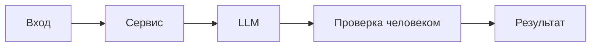

# ADR: решение для первого рабочего сценария

- Статус: proposed / accepted
- Дата:
- Ответственные:

## Контекст

Нужен AI-помощник для анализа diff PR и возврата стандартизованного результата `summary/risks/checks` по правилам CASE.md, не выходя за SCOPE-1.
## Решение

Сервис на FastAPI с эндпоинтом POST `/api/reviews`, который принимает `diff`, применяет SEC-1 (редактирование секретов), API-1 (ограничение длины) и REL-1 (timeout). Ответ формируется по OUT-1. Ошибки — контролируемые ответы.
## Рассмотренные альтернативы

| Альтернатива | Почему не выбрали сейчас |
|---|---|
| Выполнять ревью только людьми | Не стандартизирует формат; выше время ответа |
| Полностью автоматический merge | Нарушает SCOPE-1 |

## Последствия и главный риск

- Положительные последствия:
- Ограничения: запрет на действия вне анализа; нельзя логировать содержимое diff (OBS-1)
- Главный риск: утечка секретов при передаче diff в LLM (SEC-1)
- Как проверим риск: подать diff с тестовым token и убедиться, что в prompt [REDACTED]

## Архитектурная схема

## Как использовали AI

- Для чего: зафиксировать архитектурное решение и ограничения (OUT-1, SEC-1, SCOPE-1, OBS-1).
- Тип промпта: Master prompt (P1-02).
- Строка в [`prompts.md`](prompts.md): P1-02.
- Что проверили и исправили сами: проверили связность с analysis.md и product_management.md; исключили действия вне SCOPE-1.
