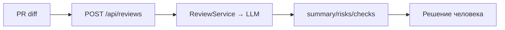

# Анализ процесса: AS IS и TO BE

## AS IS

Вход: разработчик прикрепляет diff. Ревьюер вручную читает diff, формулирует комментарии и риски без стандартизированной структуры. AI-помощник отсутствует.

## TO BE

AI-помощник анализирует diff и возвращает `summary`, `risks` (≤3) и `checks` согласно OUT-1 и QA-1; человек принимает решение.

## Разница

| Что меняется | AS IS | TO BE | Как проверим изменение |
|---|---|---|---|
| Формат результата | Свободный текст | summary/risks/checks | Проверить по OUT-1 |
| Доказательность рисков | Не требуется | QA-1: только с evidence | Просмотр 10 ответов |
| Время до ответа | Дольше | Сокращается | Замер времени |

## Как использовали AI

- Для чего: собрать AS IS/TO BE процесса для учебного кейса AI-reviewer и зафиксировать проверяемые изменения.
- Тип промпта: Master prompt (P1-02) с Context Pack.
- Строка в [`prompts.md`](prompts.md): P1-02.
- Что проверили и исправили сами: привязали TO BE к OUT-1/QA-1; проверили, что mermaid-схема и таблица «Разница» согласованы с метриками из problem.md.
