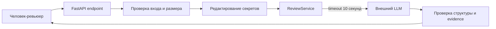

# ADR: проверяемый контур AI-ревью

Файл ведёт OpenCode. Обсудите с агентом содержание и проверьте предложенный diff. Все дополнения и исправления поручайте агенту в чате.

- Статус: proposed
- Дата: 2026-09-20
- Ответственные: владелец сервиса и человек-ревьюер; конкретные сотрудники не определены

## Контекст

Текущий endpoint передаёт `payload["diff"]` во внешний LLM без показанной валидации, ограничения размера, удаления секретов и timeout. Ответ LLM возвращается как произвольный `comment`, хотя пользователю нужен ограниченный и доказуемый результат. Решение по PR должно оставаться за человеком.

## Решение

Оставить существующие FastAPI endpoint и `ReviewService`, но добавить вокруг внешнего вызова четыре границы: проверку входа, редактирование секретов, timeout с контролируемой ошибкой и валидацию структурированного ответа. Новые самостоятельные сервисы на этом этапе не вводить. Формат невалидного входа и контролируемой ошибки уточнить до реализации.

## Рассмотренные альтернативы

| Альтернатива | Почему не выбрали сейчас |
|---|---|
| Передавать diff в LLM без промежуточных проверок | Не выполняются требования безопасности, размера и надёжности |
| Выделить отдельные Validation и Redaction сервисы | Для одного endpoint это увеличивает число компонентов без подтверждённой необходимости |
| Автоматически применять рекомендации LLM | Нарушает границу `SCOPE-1`; доказательность ответа не гарантирует правильность решения |

## Последствия и главный риск

- Положительные последствия: секреты и чрезмерные входы останавливаются до внешнего вызова; ошибки ограничены; результат можно валидировать и проверять человеком.
- Ограничения: ADR не выбирает библиотеку редактирования, формат error response и конкретного LLM-провайдера.
- Главный риск: редактирование может не распознать новый формат секрета и передать его наружу.
- Как проверим риск: набор unit-тестов для token, password и private key плюс integration-тест перехваченного prompt; список шаблонов пересматривается при каждом пропущенном случае.

## Архитектурная схема

## Как использовали AI

- Для чего: сформулировать минимальное архитектурное решение и сравнить его с альтернативами.
- Тип промпта: RCTF с Context Pack.
- Строка в [`prompts.md`](prompts.md): P1-03.
- Что проверил студент и какие исправления поручил агенту: удалены неподтверждённые отдельные сервисы и автоматические действия с PR; неизвестные контракты оставлены открытыми.
