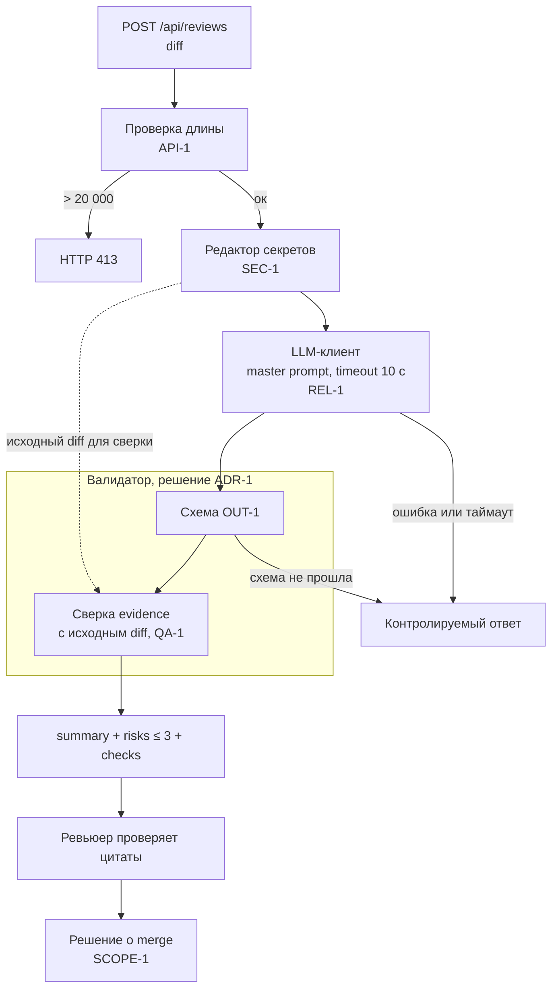

# ADR-1: валидация ответа LLM на стороне сервиса

- Статус: proposed
- Дата: 2026-09-10
- Ответственные: автор PR практики 1

## Контекст

Правило `OUT-1` задаёт контракт ответа: `summary`, массив `risks` не более чем из трёх элементов с полями `file`, `line`, `evidence`, `risk`, и массив `checks`. Правило `QA-1` требует, чтобы риск попадал в ответ только при подтверждении строкой диффа или правилом репозитория.

В текущем коде контракта нет вовсе: `app/review_service.py:16` возвращает `{"comment": answer}`, то есть сырой текст модели напрямую наружу.

Запуск `P1-02` показал, что master prompt даёт нужную форму: модель вернула валидный JSON с ровно тремя рисками, каждый с дословной цитатой. Но промпт это просьба, а не гарантия. Формулировка «верни JSON» не мешает модели вернуть текст, четвёртый риск или цитату, которой в диффе нет. Опереть контракт только на промпт значит поставить проверяемость ответа в зависимость от того, насколько модель послушалась.

Ровно это и есть исходная проблема из [`problem.md`](problem.md): в `P1-01` пять утверждений из семи не опирались ни на одно правило репозитория, и отсеивал их человек вручную.

## Решение

Сервис не возвращает ответ модели напрямую. Между вызовом LLM и HTTP-ответом стоит валидатор, выполняющий две проверки.

1. **Схема `OUT-1`.** Ответ парсится как JSON и проверяется по схеме: `summary` строка, `risks` список не длиннее трёх, каждый элемент с непустыми `file`, `line`, `evidence`, `risk`, `checks` — непустой список. Ответ, не прошедший схему, наружу не отдаётся: клиент получает контролируемую ошибку, а не сырой текст модели.
2. **Сверка evidence с диффом (`QA-1` в машинном виде).** Значение `evidence` каждого риска ищется подстрокой в исходном, до редакции секретов, диффе. Риск, чью цитату в диффе не нашли, отбрасывается как невоспроизводимый. Если после отбраковки `risks` опустел — это валидный ответ с пустым списком, а не ошибка.

Вторая проверка важнее первой. `QA-1` в промпте остаётся просьбой, которую модель может выполнить неточно; сверка подстрокой превращает его в машинно проверяемое условие. Метрика «доля рисков с evidence» из [`problem.md`](problem.md) после этого равна 100% по построению, а не по удаче.

## Рассмотренные альтернативы

| Альтернатива | Почему не выбрали сейчас |
|---|---|
| Доверять JSON от модели как есть, контракт держать только промптом | Промпт не даёт гарантии формата. Один невалидный ответ ломает клиента, и обнаружится это у ревьюера, а не в сервисе. `P1-02` прошёл удачно, но одна удачная выборка не контракт |
| Проверку evidence оставляет ревьюеру глазами | Это возврат к исходной проблеме: чтобы отделить доказанное от выдуманного, надо перечитать дифф, то есть экономии нет |
| Второй вызов LLM для проверки первого (self-critique) | Удваивает стоимость и задержку, а проверяющая инстанция имеет ту же природу, что проверяемая. Сверка подстрокой детерминирована и стоит ноль |
| Строгий structured output на стороне провайдера | Привязывает сервис к конкретному провайдеру. `context.md` фиксирует, что провайдер ещё не выбран |

## Последствия и главный риск

- Положительные последствия: соответствие `OUT-1` гарантировано сервисом, а не поведением модели; `QA-1` становится исполняемой проверкой; сырой текст модели никогда не покидает периметр сервиса; при смене модели или провайдера контракт не переписывается.
- Ограничения: валидатор проверяет **наличие** цитаты в диффе, а не истинность самого риска. Риск с настоящей цитатой и неверным выводом пройдёт. Отсев такого по-прежнему работа ревьюера. Сверка подстрокой чувствительна к пробелам и переносам: цитата, переформатированная моделью, не найдётся, хотя строка в диффе есть.
- Главный риск: строгая схема режет полезные ответы. Модель возвращает содержательный разбор, валидатор его отбраковывает целиком, и ревьюер получает ошибку вместо ревью: сервис становится хуже, чем сырой ответ.
- Как проверим риск: прогнать 20 разных диффов и посчитать долю ответов, отклонённых валидатором целиком, плюс долю отдельно отброшенных рисков. Порог приемлемости: не более 10% ответов отклонено целиком. Выше порога — ослабляем нормализацией пробелов при сверке evidence, а не отменой проверки.

## Архитектурная схема

Пунктирная стрелка существенна: сверка идёт с **исходным** диффом, до редакции секретов. Иначе цитата, попавшая под `[REDACTED]`, не найдётся, и валидный риск будет отброшен.

## Как использовали AI

- Для чего: зафиксировать решение и отвергнутые варианты для контракта ответа.
- Тип промпта: master prompt (`P1-02`). Он показал, что нужную форму ответа промпт даёт, но не гарантирует.
- Строка в [`prompts.md`](prompts.md): `P1-02`.
- Что проверили и исправили сами: решение выбрано из трёх кандидатов до написания файла. В ограничениях явно записали, чего валидатор **не** делает: `P1-02` прошёл проверку схемы с первого раза, и на этом легко было бы объявить проблему закрытой — она не закрыта, истинность вывода машина не проверяет. Порядок «сверка с исходным диффом, а не с очищенным» нашли при разборе схемы: на первом варианте пунктирной стрелки не было, и редакция секретов ломала бы сверку evidence.
