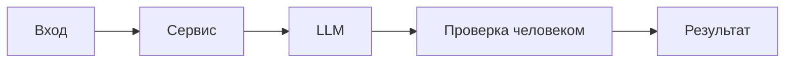

# ADR: решение для первого рабочего сценария

- Статус: proposed / accepted
- Дата: 2026-09-19
- Ответственные: команда практики

## Контекст

Нужно обеспечить предсказуемый и проверяемый обзор диффа PR через LLM для эндпоинта `/api/reviews`. Текущий код принимает произвольный `dict`, небезопасно обращается к `payload["diff"]`, вставляет сырой diff в prompt и возвращает неструктурированный текст без ограничений и обработки ошибок.

## Решение

Ввести контракт OUT‑1 (summary, ≤3 risks, checks), лимит размера входа (API‑1), таймаут внешнего вызова (REL‑1), и правила безопасности (SEC‑1, SCOPE‑1, QA‑1, OBS‑1). Валидация входа схемой запроса; строгий JSON‑ответ. Prompt формируется с явными разделителями и системной инструкцией.

## Рассмотренные альтернативы

| Альтернатива | Почему не выбрали сейчас |
|---|---|
| Оставить свободный текст ответа | Трудно парсить и автоматизировать, нет воспроизводимых проверок |
| Без лимита размера и таймаута | Риск переполнения контекста и деградации SLA |
| Сразу внедрить auth/rate limiting | Вне первого рабочего сценария; оставлено открытым вопросом |

## Последствия и главный риск

- Положительные последствия:
  - Предсказуемый ответ, проще автоматизировать проверки и визуализацию.
  - Снижение вероятности 500‑ошибок и утечек.
- Ограничения:
  - Не решает аутентификацию и rate limiting.
- Главный риск:
  - Неверная интерпретация diff моделью или ложноположительные риски.
- Как проверим риск:
  - Чек‑листы и e2e‑сценарии на проверку формата и граничных случаев; peer review.

## Архитектурная схема

## Как использовали AI

- Для чего:
- Тип промпта:
- Строка в [`prompts.md`](prompts.md):
- Что проверили и исправили сами:
