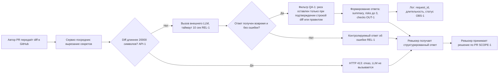

# ADR: решение для первого рабочего сценария

- Статус: proposed
- Дата: 2026-09-21
- Ответственные: команда сервиса, ревьюер-архитектор

## Контекст

Сегодня (AS IS) ревью PR идёт полностью вручную: ревьюер сам читает весь diff, ищет проблемы по памяти без чек-листа и пишет комментарии в свободной форме прямо в GitHub, а затем сам же принимает решение об approve/merge. Из-за занятости ревьюера первый комментарий по PR появляется с задержкой, ориентир для команды из 5 разработчиков и 10–15 PR в неделю — 3–6 часов (допущение). Проверка неполна: набор проверяемых правил зависит от конкретного человека, единого формата замечаний нет, часть комментариев не содержит ни файла, ни строки, ни доказательства.

Одновременно репозиторий задаёт жёсткие ограничения на то, как с diff можно обращаться при обращении к внешнему AI: секреты нельзя передавать наружу (`SEC-1`), необходимо ограничивать объём входа (`API-1`), гарантировать реакцию сервиса даже при сбое внешнего LLM (`REL-1`), возвращать только строго структурированный и подтверждённый ответ (`OUT-1`, `QA-1`), не логировать содержимое diff и ответа модели (`OBS-1`) и не давать сервису прав менять что-либо в GitHub (`SCOPE-1`). Нужно архитектурное решение, которое одновременно устраняет узкие места AS IS (задержка, неполнота, отсутствие формата) и соблюдает все перечисленные правила, не подменяя человека в принятии решения по PR.

## Решение

Строим синхронный HTTP-сервис-посредник между GitHub (или CI, вызывающим сервис на событие PR) и внешним LLM-провайдером. Ревьюер или CI отправляет diff одного PR в сервис и синхронно получает готовый структурированный ответ; никакого отложенного вебхука или очереди нет — цикл запрос/ответ укладывается в единый HTTP-вызов.

Внутри одного запроса сервис выполняет фиксированную последовательность шагов:

1. Вырезает из diff токены, пароли и приватные ключи до формирования запроса к внешнему LLM (`SEC-1`).
2. Проверяет длину diff; если она больше 20 000 символов, запрос отклоняется с HTTP 413 без обращения к LLM (`API-1`).
3. Вызывает внешний LLM с таймаутом 10 секунд; любая ошибка или превышение таймаута превращается в контролируемый ответ об ошибке, а не в необработанное исключение или зависание (`REL-1`).
4. Из ответа LLM формирует строго структурированный результат: `summary`, массив `risks` не более чем из трёх элементов (каждый с `file`, `line`, `evidence`, `risk`) и массив `checks` (`OUT-1`); риск попадает в ответ только если он подтверждён конкретной строкой diff или правилом репозитория, иначе отбрасывается (`QA-1`).
5. Пишет в лог только `request_id`, длительность обработки и статус — без содержимого diff и без текста ответа модели (`OBS-1`).
6. Возвращает ответ ревьюеру; сервис не имеет учётных данных с правом записи в GitHub, не может выполнять approve, merge или менять код — решение по PR всегда принимает человек (`SCOPE-1`).

Такой вариант выбран, потому что синхронная схема «сервис-посредник» — минимальная архитектура, которая закрывает все правила репозитория одним компонентом: пред- и постобработка (вырезание секретов, ограничение длины, валидация структуры и подтверждённости риска) физически находится между GitHub и LLM, поэтому ни один из этих шагов нельзя обойти. Синхронный HTTP-вызов также прямо соответствует TO BE из analysis.md: ответ ревьюер получает в рамках одного запроса, не позже таймаута LLM в 10 секунд, вместо ожидания часами, пока освободится человек.

## Рассмотренные альтернативы

| Альтернатива | Почему не выбрали сейчас |
|---|---|
| Собственная LLM-модель на своей инфраструктуре | Требует отдельного бюджета на обучение/инференс и GPU-инфраструктуру, что не согласуется со сроками и ресурсами команды из 5 разработчиков (допущение); не даёт немедленного выигрыша в решении задач `SEC-1`/`OUT-1`/`QA-1`, которые в любом случае нужно реализовать в сервисе-посреднике поверх модели. |
| Асинхронная обработка через очередь с вебхуком | Усложняет соблюдение `REL-1`: там, где таймаут 10 секунд и контролируемая ошибка легко реализуются в синхронном HTTP-вызове, в асинхронной схеме нужно отдельно проектировать доставку колбэка, повторные попытки и таймауты на уровне очереди — рост сложности не оправдан для одного эндпоинта на diff одного PR. |
| Готовый SaaS-линтер или встроенный AI-ревьюер GitHub | Не даёт контроля над тем, что именно отправляется во внешний провайдер и как логируются данные, поэтому нельзя гарантированно обеспечить `SEC-1` (вырезание секретов по правилам репозитория) и `OBS-1` (лог только `request_id`, длительности и статуса); также нет гарантии, что формат ответа будет соответствовать `OUT-1` (строго `summary`/`risks`/`checks` с обязательными полями) без доработки под чужой закрытый пайплайн. |

## Последствия и главный риск

- Положительные последствия: ревьюер получает `summary`, риски и проверки практически сразу вместо ожидания 3–6 часов (допущение) до первого комментария; каждый риск сопровождается файлом, строкой и доказательством вместо свободной формы; секреты не попадают во внешний LLM; в логах нет чувствительных данных; сервис физически не может выполнить approve/merge — разделение «совет» и «решение» закреплено архитектурно.
- Ограничения: сервис зависит от доступности и стабильности внешнего LLM-провайдера; diff длиннее 20 000 символов не обрабатывается вовсе (`API-1`); в ответе не может быть больше трёх рисков, даже если проблем в diff больше (`OUT-1`).
- Главный риск: модель может сформулировать риск, который не подтверждён конкретной строкой diff или правилом репозитория; если такой риск попадёт в ответ, ревьюер начнёт получать ложные срабатывания и потеряет доверие к сервису, перестав учитывать его вывод (нарушение `QA-1`).
- Как проверим риск: собрать тестовый набор из 30 учебных diff с заранее размеченными ожидаемыми рисками (включая `TRAINING_PR.diff`); прогнать каждый diff через сервис и для каждого риска в ответе вручную проверить, что указанные `file`/`line`/`evidence` действительно присутствуют в этом diff или прямо ссылаются на правило репозитория; порог приёмки — не более 1 неподтверждённого риска на 30 прогонов (не более ~3%), иначе фильтр `QA-1` считается недостаточным и дорабатывается до повторного прогона всего набора. Набор из 30 diff на момент написания ADR существует как план проверки: процедура разметки и место хранения не описаны, отдельная задача на его сбор в project_management.md отсутствует (см. react/experiment.md).

## Архитектурная схема

## Как использовали AI

- Для чего: черновик ADR (контекст, решение, альтернативы, риски, схема) по правилам из CASE.md и TO BE из analysis.md.
- Тип промпта: master prompt (роль, входы, задача и артефакты, формат, границы, шаги, проверка перед выдачей заданы явно).
- Строка в [`prompts.md`](prompts.md): P1-03 (генерация артефактов master prompt'ом).
- Что проверили и исправили сами: сверили каждое утверждение решения с конкретным правилом (`SEC-1`, `API-1`, `REL-1`, `OUT-1`, `QA-1`, `SCOPE-1`, `OBS-1`) и с шагами TO BE из analysis.md; убедились, что правила про `snake_case` и i18n не упомянуты; проверили, что в таблице альтернатив три строки с причинами отказа, привязанными к ограничениям кейса; для порога проверки главного риска задали измеримое число (не более 1 из 30, ~3%) вместо общей формулировки; проверили mermaid-схему на корректный синтаксис flowchart и наличие веток отказа по `API-1` и таймаута по `REL-1`.
