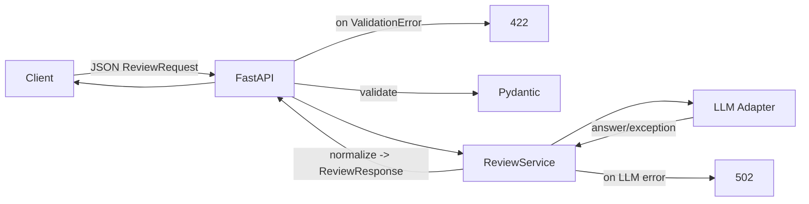

# ADR: решение для первого рабочего сценария

Файл ведёт OpenCode.

- Статус: accepted
- Дата: 2026-09-20
- Ответственные: студент (владелец практики), OpenCode (агент)

## Контекст

AS IS согласно TRAINING_PR.diff: FastAPI endpoint принимает dict и делегирует ReviewService, который вызывает абстракцию LLM без перехвата ошибок. Отсутствуют Pydantic-схемы запроса/ответа и коды 422/502.

## Решение

- Ввести Pydantic-модели ReviewRequest/ReviewResponse и указать response_model в FastAPI.
- Ограничить выходной результат: не более 3 рисков, каждый со структурой rule/evidence/check.
- Оборачивать вызов LLM адаптером с таймаутом и маппингом ошибок на 502 Bad Gateway.
- Возвращать 422 Unprocessable Entity при нарушении схемы входа.

## Рассмотренные альтернативы

| Альтернатива | Почему не выбрали сейчас |
|---|---|
| Свободный JSON без моделей | Не обеспечивает стабильный контракт и тестируемость |
| 400 вместо 422 для ошибок валидации | В FastAPI/Pydantic стандарт — 422 для body-схем |
| Пробрасывать ошибки LLM как 500 | Смешивает внутренние и внешние сбои; 502 лучше отражает внешний провайдер |

## Последствия и главный риск

- Положительные последствия: предсказуемый API, улучшенная наблюдаемость и автоматизируемые проверки.
- Ограничения: небольшое увеличение латентности из-за валидации и постобработки.
- Главный риск: некорректная нормализация ответа LLM приведёт к потере полезной информации или к несоответствию схемы.
- Как проверим риск: unit тесты на нормализацию, integration с мок‑LLM, e2e с валидным diff.

## Архитектурная схема

## Как использовали AI

- Для чего: сформулировать решение, альтернативы и последствия под учебный кейс.
- Тип промпта: master prompt, уточнения по статусам и ограничению рисков.
- Строка в [`prompts.md`](prompts.md): P1-02, P1-03.
- Что проверил студент и какие исправления поручил агенту: выравнивание с FastAPI практикой по 422, выбор 502 для внешних сбоев, риски и проверки согласованы с тестами.
