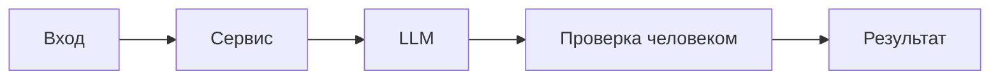

# ADR: решение для первого рабочего сценария

Файл ведёт OpenCode. Обсудите с агентом содержание и проверьте предложенный diff. Все дополнения и исправления поручайте агенту в чате.

- Статус: proposed
- Дата: 2026-09-19
- Ответственные: студент, OpenCode

## Контекст

PR `TRAINING_PR.diff` добавляет метод `review(diff: str)` в `ReviewService` и HTTP-эндпоинт `POST /api/reviews` в FastAPI, который принимает `payload: dict` и возвращает `dict[str, str]`. Интеграция обращается к абстракции `LLM.generate(prompt)`.

В текущем виде отсутствует явная валидация входа, типы запроса/ответа не закреплены схемами, возможны ошибки времени выполнения (например, `KeyError` для `payload["diff"]`), нет обработки исключений LLM.

## Решение

Для первого рабочего сценария принимаем минимально жизнеспособный контракт без изменения кода в diff и фиксируем риски и проверки:

- Документируем наблюдаемое поведение: тело запроса должно содержать поле `diff` (строка), сервис возвращает словарь с ключом `comment`.
- Фиксируем риск: при отсутствии ключа `diff` произойдёт необработанное исключение в обработчике.
- Фиксируем риск: исключения из `LLM.generate` не обрабатываются на уровне сервиса/API.
- План на следующий шаг: определить явный контракт запроса/ответа и правила обработки ошибок (без детализации кодов в отсутствие требований).

## Рассмотренные альтернативы

| Альтернатива | Почему не выбрали сейчас |
|---|---|
| Немедленный рефакторинг на модели запроса/ответа | Выходит за рамки предоставленного diff; сначала зафиксируем текущие риски |
| Добавить обработку ошибок/валидацию | Требует правок вне diff; оставить как следующий инкремент |
| Ввод ограничений на размер/время | Требует решений и требований; оставить как последующий шаг |

## Последствия и главный риск

- Положительные последствия: зафиксировано текущее поведение и риски; подготовлены проверки на ключевые ошибки.
- Ограничения: нет явной схемы запроса и обработки ошибок; последствия для клиентов не определены.
- Главный риск: сбои при некорректном входе и при исключениях LLM.
- Как проверим риск: интеграционные и E2E сценарии с отсутствующим ключом `diff` и эмуляцией исключений LLM.

## Архитектурная схема

## Как использовали AI

- Для чего: структурировать риски, определить MVP-решение и план проверок без изменения предоставленного diff.
- Тип промпта: master prompt (см. `prompts.md`).
- Строка в [`prompts.md`](prompts.md): P1-02.
- Что проверил студент и какие исправления поручил агенту: подтвердил найденные проблемы, поручил формализовать контракт, добавить тестовые сценарии и зафиксировать последовательные улучшения в планах.
