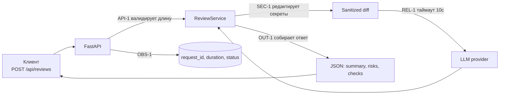

# ADR: решение для первого рабочего сценария

- Статус: accepted
- Дата: 2026-09-10
- Ответственные: Мустафин Тимур

## Контекст

В `TRAINING_PR.diff` добавлены метод `review()` и POST `/api/reviews`, однако отсутствуют обязательные правила:
- SEC-1: редактирование секретов перед вызовом внешнего LLM;
- API-1: отклонение diff > 20000 символов с HTTP 413;
- REL-1: таймаут 10с и контролируемая обработка ошибок вызова LLM;
- OUT-1: структурированный ответ `{summary, risks[≤3{file,line,evidence,risk}], checks}`;
- OBS-1: минимальное логирование (request_id, длительность, статус) без содержимого diff/ответа.

## Решение

- На входе API валидируем `diff`: если длина > 20000 — возвращаем 413 (API-1).
- Перед формированием prompt применяем редактор секретов: токены/пароли/ключи заменяем на `[REDACTED]` (SEC-1). Правила маскирования уточняем, начинаем с безопасного набора (token=, Bearer, ключи формата BEGIN PRIVATE KEY и т. п.).
- Вызов LLM выполняется с таймаутом 10 секунд; ошибки и таймауты перехватываются и конвертируются в контролируемый ответ в формате OUT-1 (REL-1).
- Ответ API всегда соответствует OUT-1: заполняем `summary`; `risks` максимум три, только подтверждённые evidence; `checks` — воспроизводимые шаги (OUT-1, QA-1).
- Логи: только `request_id`, длительность, статус; содержимое diff и ответ модели не логируем (OBS-1).

## Рассмотренные альтернативы

| Альтернатива | Почему не выбрали сейчас |
|---|---|
| Обрабатывать ошибки только на уровне API | Риск утечек деталей из сервиса и дублирования логики; предпочтительнее инкапсуляция в сервисе с единым контрактом |
| Асинхронная очередь вместо синхронного вызова | Усложняет первый сценарий; синхронного ответа достаточно, очередь — возможный следующий инкремент |

## Последствия и главный риск

- Положительные последствия:
  - Предсказуемый контракт ответа; защищённость от утечек; устойчивость к сбоям провайдера.
- Ограничения:
  - Возможна частичная маскировка секретов при неполном наборе паттернов; требуется донастройка.
- Главный риск:
  - Недостаточное покрытие правил редактирования секретов может привести к утечке.
- Как проверим риск:
  - Unit-тест редактора секретов с примерами токенов/ключей; интеграционный тест на отсутствие утечек в отправляемом prompt.

## Архитектурная схема

## Как использовали AI

- Для чего: сверить решение с правилами SEC-1, API-1, REL-1, OUT-1, OBS-1 и сформировать минимально достаточную архитектуру.
- Тип промпта: master prompt (P1-02) с контекстом.
- Строка в [`prompts.md`](prompts.md): P1-02; Master Prompt v1.
- Что проверили и исправили сами: связность компонентов с TRAINING_PR.diff; проверили наличие обязательных разделов и рендер схемы.
