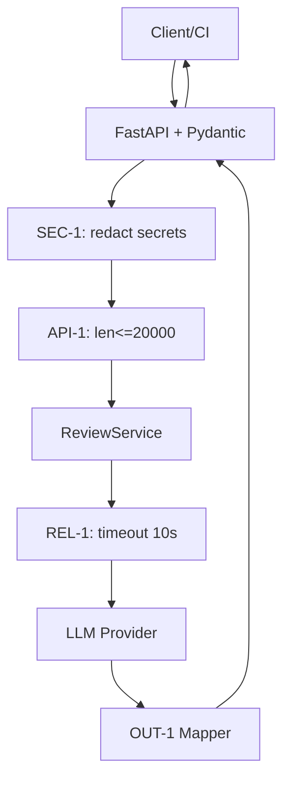

# ADR-001: Интеграция AI-ассистента code review

- Статус: Proposed
- Дата: 2026-09-10
- Ответственные: команда практики

## Context

Исходный код по TRAINING_PR.diff добавляет синхронный эндпоинт FastAPI `/api/reviews`, который принимает `dict` без схемы, и сервис `ReviewService.review`, формирующий промпт с raw diff и вызывающий `llm.generate`. Правила CASE.md задают ограничения: SEC-1 (редактировать секреты), API-1 (отклонять diff > 20k символов с 413), REL-1 (таймаут 10с и контролируемый ответ), OUT-1 (стабильный контракт ответа), SCOPE-1 (сервис только советует). Цели в problem.md: снизить 422/500 < 1%, удержать P95, исключить утечки.

## Problem

Нужно встроить LLM-вызов так, чтобы соблюсти SEC-1, API-1, REL-1 и OUT-1, при этом не блокировать обработку и предоставить предсказуемый контракт ответа.

## Options

| Вариант | Плюсы | Минусы | Стоимость |
|---|---|---|---|
| A: Синхронный FastAPI + threadpool для LLM, Pydantic для тела, препроцессинг | Проста интеграция, минимум изменений | Возможные блокировки на высоких RPS, управление таймаутами вручную | Низкая |
| B: Полноценный async стек (async def, httpx AsyncClient), очереди для LLM | Лучшая масштабируемость, естественные таймауты | Сложнее реализация, больше кода и тестов | Средняя |
| C: Вынести LLM в отдельный воркер (Celery/RQ), API — быстрый ack | Надёжность, нет блокировок, ретраи | Усложнение инфраструктуры, задержка ответа | Средняя/Высокая |

## Decision

Выбрать A на первый инкремент: добавить Pydantic-схему, предварительную обработку diff (SEC-1, API-1), таймаут вызова LLM через threadpool/обёртку и формирование ответа по OUT-1. Это соответствует целям минимальных изменений и срокам учебной практики.

## Rationale

Выбор A минимизирует изменения и риски в рамках занятия. Он покрывает метрики из problem.md (ошибки, P95, утечки) и следует ограничениям CASE.md. Переход к B/C возможен при росте нагрузки и будет рассмотрен в последующих инкрементах. Критерии выбора: срок внедрения, сложность реализации, риск нарушения SLA.

## Consequences

- Положительные: быстрый прогресс, соблюдение SEC-1, API-1, REL-1, OUT-1, улучшение ошибок и контракта.
- Отрицательные: ограниченная масштабируемость под пиковые RPS; сложнее обеспечить строгие SLA без очереди.

## Integration points

- SEC-1: модуль редактирования секретов перед генерацией промпта.
- API-1: проверка длины тела diff на уровне API.
- REL-1: обёртка вызова LLM с таймаутом 10с и предсказуемым фолбэком.
- OUT-1: слой маппинга ответа LLM в контракт `{summary, risks[], checks[]}`.
- OBS-1: логирование только `request_id`, длительности и статуса; содержимое diff/ответа не логируется.

## Архитектурная схема

## Open Questions

- Конкретные паттерны секретов для редактирования? (нет данных в источнике)
- Численные цели по P95 с LLM включительно? (нет данных)

## Как использовали AI

- Запрос: practices/practice_01/prompts/arch.md
- Тип промпта: master (Role + Context Pack)
- Ссылка: prompts.md#master-3
- Проверка: соответствие CASE.md и связка с problem.md метриками.
