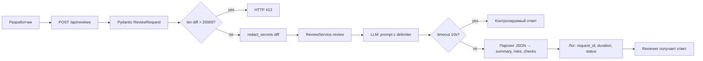

# ADR: решение для первого рабочего сценария

- **Статус**: proposed
- **Дата**: 2026-09-10
- **Ответственные**: backend-tech-lead, AI-ассистент (P1-02)

## Контекст

PR `TRAINING_PR.diff` добавляет эндпоинт `POST /api/reviews` и метод `ReviewService.review`. Текущая реализация (app/api.py:35-37, app/review_service.py:13-16) нарушает 5 правил репозитория: SEC-1 (нет очистки секретов), API-1 (нет лимита размера), REL-1 (нет таймаута), OUT-1 (сырой ответ `{"comment": answer}` вместо `summary` + `risks` + `checks`), OBS-1 (нет логирования). Требуется выбрать архитектурное решение, удовлетворяющее всем правилам и не выходящее за SCOPE-1 (только советы).

## Решение

Ввести слой защиты на границе `POST /api/reviews`:

1. **Pydantic-модель `ReviewRequest`** с полем `diff: str` и валидацией (app/api.py:36).
2. **Проверка размера** — если `len(diff) > 20 000`, возвращаем HTTP 413 (API-1).
3. **Redact секретов** через функцию `redact_secrets(diff)` перед передачей в LLM (SEC-1).
4. **`ReviewService.review`** оборачивает `llm.generate` в `try/except` с таймаутом 10 секунд (REL-1); при ошибке возвращает контролируемый ответ.
5. **Структурированный ответ** — парсим JSON-ответ LLM в `summary`, `risks` (max 3), `checks` (OUT-1).
6. **Логирование** — `request_id`, `duration`, `status` только (OBS-1); diff и ответ LLM не логируются.

## Рассмотренные альтернативы

| Альтернатива | Почему не выбрали сейчас |
|---|---|
| Передавать diff в LLM как есть, без redact | Нарушает SEC-1 — риск утечки токенов |
| Возвращать сырой текст `{"comment": answer}` | Нарушает OUT-1 — ответ не парсится автоматически |
| Без таймаута и try/except | Нарушает REL-1 — сервис зависает |
| Без проверки размера diff | Нарушает API-1 — риск переполнения токенами |
| Логировать содержимое diff и ответ | Нарушает OBS-1 — утечка данных в логи |
| Выполнять merge/approve в GitHub | Нарушает SCOPE-1 — сервис только советует |

## Последствия и главный риск

- **Положительные последствия**: ответ всегда структурирован и пригоден для автоматической обработки; секреты не утекают; сервис не зависает на медленном LLM; можно мониторить через request_id/duration/status.
- **Ограничения**: строгий парсинг JSON-ответа LLM может дать пустой `risks`, если LLM не справился — нужен fallback.
- **Главный риск**: LLM возвращает не-JSON, парсинг падает. Как проверим: unit-тест с LLM, возвращающим произвольный текст — сервис должен вернуть контролируемый ответ с пустыми risks, а не 500.
- **Как проверим риск**: tests_unit.md — LLM возвращает `not json` → ответ `{"summary": "...", "risks": [], "checks": ["parse error"]}`, HTTP 200.

## Архитектурная схема

## Как использовали AI

- Для чего: выбор архитектурного решения, удовлетворяющего всем 7 правилам репозитория
- Тип промпта: zero-shot (P1-01), затем уточнение с master prompt (P1-02)
- Строка в `prompts.md`: P1-01, P1-02
- Что проверили и исправили сами: каждая ветка решения связана с конкретным правилом (SEC-1, API-1, REL-1, OUT-1, OBS-1, SCOPE-1)
