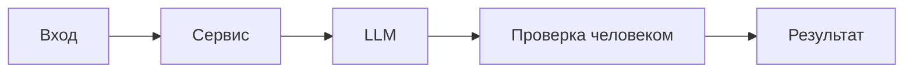

# ADR: решение для первого рабочего сценария

Файл ведёт OpenCode. Обсудите с агентом содержание и проверьте предложенный diff. Все дополнения и исправления поручайте агенту в чате.

- Статус: accepted
- Дата: 2026-09-19
- Ответственные: автор PR и учебная команда

## Контекст

Учебный кейс: ассистент ревьюера PR анализирует предоставленный unified diff и возвращает структурированный отчёт. Решение принимает человек; ассистент не меняет код и не выполняет approve/merge. Источники вне diff не используются.
## Решение

Встроить ассистента в процесс ревью как инструмент предварительного анализа diff (с обязательной проверкой человеком):
- вход: только unified diff;
- выход: описание, до трёх пунктов (доказанный дефект или потенциальный риск), список предложенных проверок;
- человек всегда подтверждает выводы и принимает решение.
## Рассмотренные альтернативы

| Альтернатива | Почему не выбрали сейчас |
|---|---|
| Полностью автоматическое ревью и merge | Противоречит требованию человека в контуре и повышает риск ошибок |
| RAG по репозиторию и документации | Выходит за рамки учебного кейса «только diff» |
| Автоматическое исправление кода | Вне рамок практики и ответственности ассистента |

## Последствия и главный риск

- Положительные последствия: сокращение рутины, повышение доказательности выводов (цитаты из diff), фокус на ключевых рисках.
- Ограничения: только diff как источник; не более трёх пунктов в отчёте; запрет на внешние инструменты.
- Главный риск: влияние содержимого diff на поведение LLM (prompt injection) — как гипотеза.
- Как проверим риск: целевая проверка с директивным текстом в diff; результат оценивает человек.

## Архитектурная схема

## Как использовали AI

- Для чего: зафиксировать решение «человек в контуре» и границы ассистента.
- Тип промпта: структурированный запрос (Build-сессия).
- Строка в [`prompts.md`](prompts.md): P1-04.
- Что проверил студент и какие исправления поручил агенту: отделил гипотезы (риски) от подтверждённых дефектов; оставил обработку статусов API на стороне человека.
