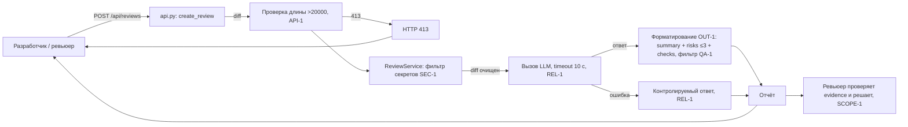

# ADR: решение для первого рабочего сценария

- Статус: accepted
- Дата: 2026-09-20
- Ответственные: команда практики 1, практика «AI-помощник ревьюера PR»

## Контекст

Сервис ревью PR (`app/review_service.py`, `app/api.py`) принимает diff и возвращает единственное поле `comment` — произвольный текст внешнего LLM. Текущая реализация:

- отправляет diff во внешний LLM без удаления токенов, паролей и ключей (SEC-1 нарушен);
- не проверяет длину diff — огромный diff не отклоняется (API-1 нарушен);
- синхронно вызывает LLM без timeout 10 с и без обработки ошибки (REL-1 нарушен);
- возвращает неструктурированный результат, непригодный для решения человека (OUT-1 нарушен).

Нужен помощник ревьюера, который даёт ревьюеру точные, подтверждённые и проверяемые замечания, сохраняя решение за человеком.

## Решение

Ввести фасад `ReviewService`, который становится сухопутной гарантией перед внешним LLM, и публиковать его через `POST /api/reviews`:

1. **API-1:** на входе проверять длину diff; >20 000 символов → HTTP 413.
2. **SEC-1:** перед вызовом LLM фильтровать секреты (токены, пароли, приватные ключи) → `[REDACTED]`.
3. **REL-1:** вызывать LLM с timeout 10 с; ошибка/таймаут → контролируемый ответ, а не исключение и HTTP 500.
4. **OUT-1 + QA-1:** приводить ответ LLM к контракту `summary` + `risks` (≤3, с `file`/`line`/`evidence`/`risk`) + `checks`; риск включается только при подтверждении строкой diff или правилом.
5. **SCOPE-1 + OBS-1:** сервис только советует (не approve/merge/edit); в лог пишутся только `request_id`, длительность и статус.

Человек остаётся в контуре: ревьюер проверяет каждый риск и принимает решение о merge.

## Рассмотренные альтернативы

| Альтернатива | Почему не выбрали сейчас |
|---|---|
| Возвращать сырой ответ LLM как сейчас (`{"comment": ...}`) | Нарушает SEC-1/REL-1/OUT-1: нет фильтрации секретов, таймаута и структуры; ответ недоказуем |
| Асинхронная очередь (Celery/очередь задач) для вызова LLM | Усложняет инкремент: для первого сценария достаточно timeout 10 с и контролируемой ошибки; вернёмся при росте нагрузки (см. `tests_load.md`) |
| Отказаться от LLM, использовать только эвристики/линтеры | Не даёт контекстного анализа связи «нарушение → строка diff»; правила SEC-1…OBS-1 требуют понимания смысла кода |
| Отправлять в LLM весь репозиторий, а не diff | Дорого и избыточно; для ревью одного PR достаточно diff + Context Pack | 

## Последствия и главный риск

- Положительные последствия: контролируемые вход и выход; секреты не покидают сервис; сбои LLM дают понятную ошибку; результат можно проверять и включать в решение о merge; наблюдаемость по OBS-1.
- Ограничения: максимум 3 риска на ревью; риск только при evidence (QA-1); сервис не меняет код и не работает с GitHub (SCOPE-1). Небольшие диффы: показываем плоской строкой, а не потоковой передачей.
- Главный риск: LLM сгенерирует риск, который не подтверждается diff или правилом (галлюцинация), и ревьюер сделает ложное замечание.
- Как проверим риск: diff без явных нарушений → ожидаем `risks: []`; каждый риск сверяем со строкой diff или правилом (QA-1); E2E-сценарий из `tests_e2e.md`.

## Архитектурная схема

## Как использовали AI

- Для чего: выбрать архитектурное решение (фасад перед внешним LLM), рассмотреть альтернативы и собрать схему процесса
- Тип промпта: zero-shot (P1-01), master prompt (P1-02)
- Строка в [`prompts.md`](prompts.md): P1-01, P1-02
- Что проверили и исправили сами: каждый элемент схемы соответствует правилу Context Pack (SEC-1/API-1/REL-1/OUT-1/QA-1/SCOPE-1/OBS-1) и строке diff; убрали альтернативы без обоснования