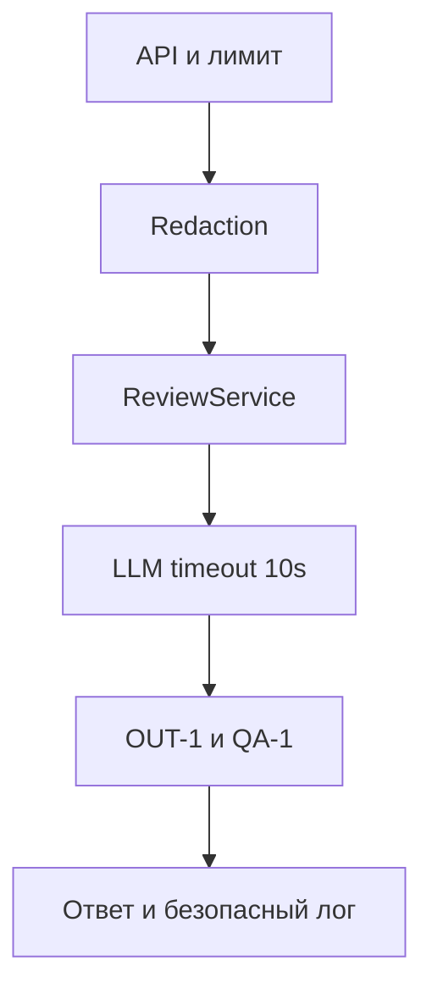

# ADR: синхронный policy pipeline для ревью diff

- Статус: accepted
- Дата: 2026-09-20
- Ответственный: Ланских Глеб Константинович

## Контекст

Текущий endpoint передаёт сырой diff во внешний LLM и возвращает `comment`. Это не выполняет `SEC-1`, `API-1`, `REL-1` и `OUT-1`.

## Решение

Оставить один синхронный HTTP-сценарий, но до LLM выполнить валидацию и redaction, ограничить вызов 10 секундами, затем проверить структуру ответа. В лог писать только `request_id`, длительность и статус по `OBS-1`. AI остаётся советчиком по `SCOPE-1`.

## Рассмотренные альтернативы

| Альтернатива | Почему не выбрали сейчас |
|---|---|
| Оставить текущий прямой вызов | Нарушает обязательные правила кейса |
| Фоновая очередь и polling | Добавляет инфраструктуру, которой нет во входе; для timeout 10 секунд избыточна |
| Синхронный policy pipeline | Выбрано: минимальное изменение с проверяемыми границами |

## Evidence

| Утверждение | Источник |
|---|---|
| Сырой diff вставляется в prompt | `TRAINING_PR.diff`, строки 19–21 |
| Возвращается поле `comment` | `TRAINING_PR.diff`, строка 22 |
| Нужны redaction, лимит, timeout и схема | `CASE.md`: `SEC-1`, `API-1`, `REL-1`, `OUT-1` |
| AI только советует, лог не содержит diff | `CASE.md`: `SCOPE-1`, `OBS-1` |

## Последствия и главный риск

- Плюсы: политика проверяется до дорогого вызова; формат ответа стабилен; решение остаётся простым.
- Ограничения: запрос ждёт LLM до 10 секунд; качество redaction зависит от набора детекторов.
- Главный риск: секрет нестандартного формата пройдёт redaction.
- Проверка риска: набор тестовых токенов, паролей и приватных ключей; fake LLM должен получить только `[REDACTED]`.

## Архитектурная схема

## Как использовали AI

- Для чего: сравнить минимальную, очередь и policy-pipeline альтернативы.
- Тип промпта: Few-shot, R.C.T.F., CoV, ToT, RAG и ReAct.
- Строка в [`prompts.md`](prompts.md): `P1-03`; детали — [`../practice_02/prompts.md`](../practice_02/prompts.md).
- Проверка человеком: удалены неподтверждённые требования про auth, БД и GitHub-действия.
