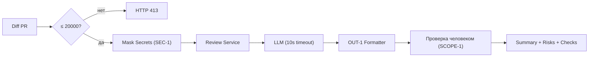

# ADR: решение для первого рабочего сценария

- Статус: proposed / accepted
- Дата: 2026-09-04
- Ответственные: Lead SDLC Architect, команда backend

## Контекст

Сервис AI-помощника ревью PR должен анализировать diff и возвращать структурированный отчёт, соблюдая правила SEC-1, API-1, REL-1, OUT-1, QA-1, OBS-1 и границы SCOPE-1. Текущая реализация принимает необработанный diff, вызывает LLM без таймаута и возвращает неструктурированный ответ.

## Решение

В рамках минимальной доработки внедрить:
- Ограничение длины входного diff и ответ 413 при >20000 символов (API-1).
- Маскирование секретов перед отправкой diff в LLM (SEC-1).
- Обёртку вызова LLM с таймаутом 10 секунд и маппинг исключений в контролируемый ответ (REL-1).
- Форматировать ответ строго по OUT-1: summary, массив risks (≤3) с file/line/evidence/risk и массив checks.
- Логирование по OBS-1: только request_id, длительность, статус.
- Сохранить роль человека-ревьюера (SCOPE-1) и правило QA-1 — включать только подтверждённые риски.

## Рассмотренные альтернативы

| Альтернатива | Почему не выбрали сейчас |
|---|---|
| Отложить маскирование секретов | Неприемлемый риск SEC-1: утечки секретов во внешний LLM |
| Полностью синхронная долгоживущая операция без таймаута | Нарушает REL-1, увеличивает отказоустойчивость риска |
| Расширенный набор рисков >3 | Нарушает OUT-1 и перегружает пользователя |
| Логировать полный prompt/ответ | Нарушает OBS-1 и безопасность |

## Последствия и главный риск

- Положительные последствия:
  - Предсказуемый контракт ответа и проверяемые риски, снижение утечек, контролируемые отказы.
- Ограничения:
  - Возможна потеря деталей при сокращении diff; не все риски попадут в топ-3.
- Главный риск:
  - Ложные срабатывания маскирования (перемаскирование), ухудшающие качество evidence.
- Как проверим риск:
  - Интеграционные тесты с искусственными секретами; peer review evidence; журналирование только служебных полей.

## Архитектурная схема

## Как использовали AI

- Для чего: сформулировать минимальное архитектурное решение в рамках правил SEC-1…OBS-1.
- Тип промпта: master prompt.
- Строка в [`prompts.md`](prompts.md): P1-03.
- Что проверили и исправили сами: проверили совместимость решений с текущим кодом diff, уточнили альтернативы и риски, скорректировали схему.
