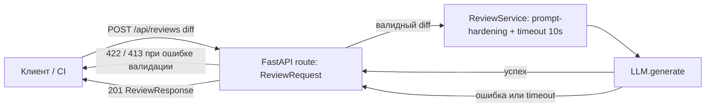

# ADR: решение для первого рабочего сценария

- Статус: proposed
- Дата: 2026-09-07
- Ответственные: X_xp

## Контекст

Эндпоинт `POST /api/reviews` в текущем виде принимает произвольный `dict`, не валидирует вход, не ограничивает размер `diff`, не обрабатывает ошибки LLM-вызова и не имеет объявленной схемы ответа (см. [`problem.md`](problem.md), [`context.md`](context.md), результат P1-02 в [`prompts.md`](prompts.md)). Нужно решение, которое минимально меняет сервис, но закрывает риски необработанных 500, неограниченных затрат на LLM и утечки секретов через prompt, не выходя за рамки роли сервиса как советующего ассистента (`SCOPE-1`).

## Решение

Ввести Pydantic-модели `ReviewRequest`/`ReviewResponse` на границе API (`app/api.py`), лимит размера `diff` на уровне валидатора (413 при превышении 20 000 символов, `API-1`), `try/except` и timeout 10 секунд вокруг вызова `llm.generate` в `ReviewService` (`REL-1`), и шаблон промпта с явным разделением system/user частей и редактированием секретов перед отправкой (`SEC-1`). Ответственность разделена по границе: FastAPI-слой отвечает за контракт и статус-коды, `ReviewService` — за таймауты, харднинг промпта и устойчивость к сбоям LLM.

## Рассмотренные альтернативы

| Альтернатива | Почему не выбрали сейчас |
|---|---|
| Ручная валидация внутри route без Pydantic | Дублирует то, что FastAPI даёт бесплатно; не даёт OpenAPI-схему клиентам; сложнее поддерживать по мере роста контракта |
| Асинхронная очередь/воркер для LLM-вызова | Избыточная инфраструктурная сложность для текущего объёма нагрузки (см. обоснование в [`tests_load.md`](tests_load.md)); можно пересмотреть при росте трафика |
| Отдельный прокси-сервис для санитизации diff перед `ReviewService` | Больше движущихся частей ради задачи, которую решает одна функция редактирования секретов внутри существующего сервиса |

## Последствия и главный риск

- Положительные последствия: 5xx остаются только для реально неожиданных сбоев; клиенты получают предсказуемый контракт и понятные статусы ошибок; расходы на LLM ограничены лимитом размера входа.
- Ограничения: решение сознательно не покрывает аутентификацию и rate limiting (см. «Что не входит в задачу» в [`problem.md`](problem.md)).
- Главный риск: порог в 20 000 символов может оказаться слишком жёстким для реальных PR и отклонять легитимные diff.
- Как проверим риск: метрика «доля отклонённых из-за лимита» из [`problem.md`](problem.md); порог пересматривается, если доля отклонений превышает 5%.

## Архитектурная схема

## Как использовали AI

- Для чего: собрать архитектурное решение из подтверждённых рисков P1-02, не добавляя ничего сверх Context Pack.
- Тип промпта: master prompt.
- Строка в [`prompts.md`](prompts.md): P1-02.
- Что проверили и исправили сами: сопоставили каждый пункт решения с конкретным правилом (`SEC-1`/`API-1`/`REL-1`) и с конкретной строкой diff, а не только с общими best practices.
