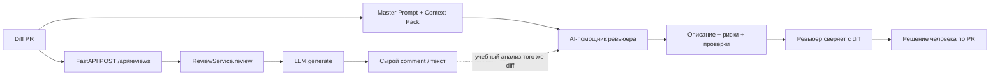

# ADR: решение для первого рабочего сценария

- Статус: accepted (учебный кейс Практики 1)
- Дата: 2026-09-20
- Ответственные: студент (владелец артефактов) + AI-помощник ревьюера (черновик анализа); решение по PR — только человек

## Контекст

Нужен способ ускорить подготовку ревью одного PR по diff так, чтобы замечания были доказуемы (файл, строка, цитата), а AI не подменял человека. Во входе учебного сценария есть FastAPI-эндпоинт `POST /api/reviews` и `ReviewService.review`, передающий diff в LLM. Требуется архитектурное решение для помощника ревьюера (процесса и контракта ответа), согласованное с границами: без approve/merge и без правок кода.

## Решение

Принять архитектуру «человек в контуре» (human-in-the-loop):

1. Вход — только diff (+ master prompt / Context Pack для агента-ревьюера).
2. Слой анализа — LLM по протоколу `LLM.generate`, оркестрация через сервис ревью.
3. Выход — структурированный черновик (описание, ≤3 риска с доказательством, проверки), который ревьюер обязан сверить с diff перед решением.
4. Границы AI зафиксированы в Context Pack и Definition of Done.

Для продукта из `TRAINING_PR.diff` сохранить разделение: HTTP API → `ReviewService` → LLM; усиление валидации входа — отдельное решение (см. риски в прогонах P1-01/P1-02).

## Рассмотренные альтернативы

| Альтернатива | Почему не выбрали сейчас |
|---|---|
| Полностью автоматический merge/approve по вердикту LLM | Нарушает учебные и продуктовые границы; нет доказательной ответственности человека |
| Только статический анализ без LLM | Не закрывает задачу «описание + риски на естественном языке»; может дополнять позже (**Открытый вопрос** о комбинации) |
| Свободный чат без Context Pack (чистый zero-shot) | Baseline P1-01: слабее доказательность и воспроизводимость; оставлен как контроль, не как целевой режим |

## Последствия и главный риск

- Положительные последствия: единый формат черновика; меньше общих советов; явные проверки.
- Ограничения: качество зависит от полноты diff и дисциплины промпта; нет доступа к рантайму/прод-логам.
- Главный риск: LLM или API-слой принимают невалидный вход / падают без контролируемого ответа (в diff: `payload["diff"]` без проверки; `llm.generate` без обработки ошибок).
- Как проверим риск: unit/API-тесты на отсутствующий `diff`; integration на исключение LLM; разметка ответов помощника на выдуманные требования.

## Архитектурная схема

## Как использовали AI

- Для чего: ADR и архитектурная схема human-in-the-loop.
- Тип промпта: master prompt / ADR drafting.
- Строка в [`prompts.md`](prompts.md): P1-01 и P1-02.
- Что проверил студент и какие исправления поручил агенту: схема согласована с файлами из `TRAINING_PR.diff`; альтернативы без выдуманных прод-ограничений.
