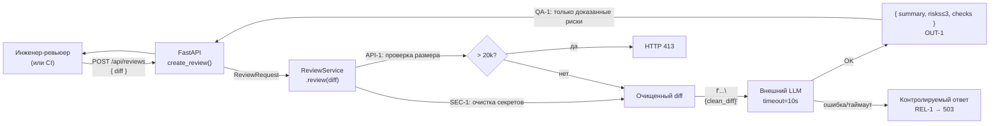

# ADR: решение для первого рабочего сценария

- Статус: accepted
- Дата: 2026-09-16
- Ответственные: инженер-ревьюер (владелец решения)

## Контекст

Сервис `ReviewService` принимает git diff от ревьюера и возвращает автоматическое ревью через внешний LLM. По результату zero-shot запуска (P1-01) выявлены ключевые риски текущей реализации (`TRAINING_PR.diff`):

1. **Нет валидации входа** — `POST /api/reviews` принимает `dict` без Pydantic-схемы → `KeyError` при отсутствии поля `diff` → HTTP 500 вместо 422.
2. **Diff уходит в LLM без очистки** — нарушение `SEC-1`; секреты могут попасть во внешний LLM.
3. **Нет ограничения размера** — нарушение `API-1`; большой diff вызовет превышение лимита контекста или высокие расходы.
4. **Нет timeout и обработки ошибок** — нарушение `REL-1`; любое исключение LLM вернёт 500 без понятного сообщения.
5. **Ответ — плоская строка** — нарушение `OUT-1`; нет структуры `{ summary, risks, checks }`.

## Решение

Принять последовательное усиление `ReviewService` и `create_review`:

1. Добавить Pydantic-модели `ReviewRequest(diff: str)` и `ReviewResponse(summary, risks, checks)`.
2. Реализовать очистку секретов из diff до вызова `LLM.generate` (правило `SEC-1`).
3. Добавить проверку длины diff (> 20 000 символов → HTTP 413, правило `API-1`).
4. Обернуть `LLM.generate` в `try/except` с таймаутом 10 секунд (правило `REL-1`).
5. Изменить формат ответа на `{ summary, risks: [{file, line, evidence, risk}], checks }` (правило `OUT-1`).
6. Сделать эндпоинт `async` и использовать асинхронный клиент LLM или `run_in_threadpool`.

## Рассмотренные альтернативы

| Альтернатива | Почему не выбрали сейчас |
|---|---|
| Синхронный эндпоинт + блокирующий LLM | Блокирует worker FastAPI при медленном LLM; снижает throughput при конкурентных запросах |
| Фоновая задача (webhook / queue) | Усложняет архитектуру; нецелесообразно для MVP учебного сценария |
| Встроенный LLM (локальная модель) | Требует инфраструктуры GPU; выходит за рамки задачи |

## Последствия и главный риск

- **Положительные последствия:** устранение `SEC-1`-нарушения предотвращает утечку секретов; структурированный ответ позволяет автоматизировать дальнейшую обработку.
- **Ограничения:** лимит 20 000 символов (`API-1`) не позволяет анализировать очень крупные PR целиком; потребуется chunking в следующем инкременте.
- **Главный риск:** очистка секретов (`SEC-1`) реализована эвристически и может ложноположительно редактировать полезные строки diff.
- **Как проверим риск:** тест с diff, содержащим `API_KEY=test123` — ожидаем `[REDACTED]` в промпте; тест с обычной строкой — ожидаем сохранение содержимого.

## Архитектурная схема

## Как использовали AI

- Для чего: выявление архитектурных проблем текущей реализации через zero-shot (P1-01).
- Тип промпта: zero-shot (P1-01) — findings High/Medium послужили основой для раздела «Контекст».
- Строка в [`prompts.md`](prompts.md): P1-01.
- Что проверили и исправили сами: каждое решение сопоставлено с правилом из `CASE.md`; альтернативы добавлены самостоятельно — AI их не предлагал; Mermaid-схема построена вручную и сверена с правилами.
