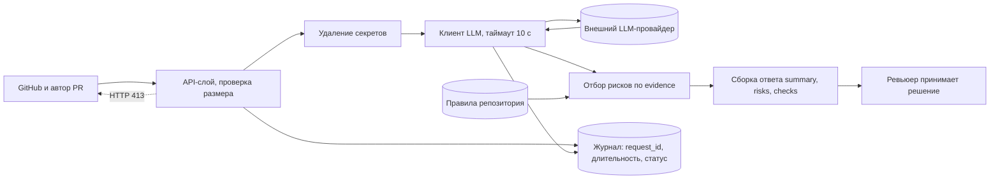

# ADR: решение для первого рабочего сценария

- Статус: proposed
- Дата: 2026-09-05
- Ответственные: GooseBananovy

## Контекст

Помощнику нужно по diff одного пул-реквеста находить нарушения правил репозитория и возвращать их с доказательством. Часть нарушений смысловые, они не выражаются шаблоном или регулярным выражением, поэтому нужен разбор естественного языка и кода.

Одновременно действуют ограничения. Правило `SEC-1` запрещает отдавать наружу токены, пароли и приватные ключи. Правило `REL-1` требует, чтобы отказ внешней зависимости не превращался в падение сервиса. Правило `OUT-1` фиксирует контракт ответа, а `QA-1` запрещает выдавать неподтверждённые утверждения. Baseline-запуск `P1-01` показал, что без явно переданных правил модель пропускает главный риск и выходит за границы роли.

## Решение

Использовать **внешний LLM-провайдер синхронным вызовом**, обвязав его четырьмя обязательными слоями:

1. проверка размера входа до любого внешнего обращения, отказ с HTTP 413 по `API-1`
2. удаление токенов, паролей и ключей из diff до формирования промпта по `SEC-1`
3. вызов с таймаутом 10 секунд, отказ превращается в контролируемый ответ по `REL-1`
4. отбор рисков на стороне сервиса: в ответ попадают только подтверждённые строкой diff или кодом правила, не более трёх, в фиксированной структуре `summary`, `risks`, `checks`

Модель отвечает за язык и смысл, сервис отвечает за безопасность, границы и формат. Решение о комментариях и мерже остаётся за ревьюером.

## Рассмотренные альтернативы

| Альтернатива | Почему не выбрали сейчас |
|---|---|
| Локальная модель на своём железе | Снимает вопрос утечки, но требует закупки и обслуживания GPU, а качество разбора кода у доступных локальных моделей ниже. Срок до первого работающего инкремента вырастает настолько, что метрики нечем будет измерить |
| Только статические правила без LLM, линтер и регулярные выражения | Дёшево и детерминированно, но покрывает лишь формальные нарушения. Смысловые проблемы вроде передачи содержимого diff наружу без вычистки такой проверкой не ловятся, а именно они дороже всего обходятся |
| Внешний LLM без удаления секретов | Самая простая реализация и наименьшая задержка, но это прямое нарушение `SEC-1`. Отклонено без обсуждения сроков |
| Асинхронная обработка через очередь | Снимает удержание воркера на 10 секунд, но добавляет хранение задач и статусов, а вместе с ними хранение содержимого diff, что конфликтует с `OBS-1`. Вернуться к вопросу, если синхронный вызов упрётся в пропускную способность |

## Последствия и главный риск

- Положительные последствия: первый инкремент можно запустить без закупки железа. Правила репозитория перестают быть устной договорённостью и становятся кодом. Ревьюер получает разбор с доказательством и сохраняет право решения.
- Ограничения: появляется зависимость от доступности и цены внешнего провайдера. Синхронный вызов удерживает воркер до 10 секунд. Удаление секретов работает по списку паттернов и не даёт математической гарантии.
- Главный риск: **неполное удаление секретов**. Токен нового или нетипичного формата не совпадёт ни с одним паттерном и уедет во внешний сервис вместе с diff. Это нарушение `SEC-1` с последствиями за пределами сервиса.
- Как проверим риск: постоянный набор проверок с корпусом секретов разных форматов, включая заведомо не описанный паттерном. Ожидаемое поведение — либо секрет вычищен, либо запрос отклонён целиком. Проверка обязана быть предварительной, а не расследованием по факту: `OBS-1` запрещает писать содержимое diff и промпта в журнал, поэтому восстановить постфактум, что именно ушло наружу, будет нечем.

## Архитектурная схема

## Как использовали AI

- Для чего: черновик архитектурного решения, альтернатив и схемы компонентов
- Тип промпта: итеративный диалог с контекстом
- Строка в [`prompts.md`](prompts.md): `P1-06`
- Что проверили и исправили сами: сверил решение и все четыре альтернативы с правилами `CASE.md`. Статус оставил `proposed`, поскольку ни одна проверка из плана ещё не выполнена
