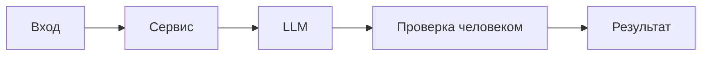

# ADR: решение для первого рабочего сценария

- Статус: proposed / accepted
- Дата: 2026-09-20
- Ответственные: Караханов Максим

## Контекст

Нужно обеспечить воспроизводимое первичное ревью PR: помощник принимает diff и возвращает структурированный ответ (summary, ≤3 risks с evidence, checks). Требования и правила зафиксированы в CASE.md и Context Pack.

## Решение

Используем FastAPI‑сервис с ReviewService, который формирует промпт для внешнего LLM. Промпт включает явные разделители и фиксированный формат ответа (OUT‑1). Перед отправкой удаляются секреты (SEC‑1), применяется таймаут 10 с (REL‑1). Ответ парсится/валидируется в заданную структуру.

## Рассмотренные альтернативы

| Альтернатива | Почему не выбрали сейчас |
|---|---|
| Полностью ручное ревью | Невоспроизводимо и медленно, нет структуры evidence |
| Автономный агент, правящий код | Нарушает SCOPE‑1, риски и контроль |
| Встраивание правил в GitHub Actions без LLM | Не покрывает смысловые риски в diff |

## Последствия и главный риск

- Положительные последствия:
- Ограничения:
- Главный риск:
- Как проверим риск:
  - Положительные: быстрее первичное ревью, более доказательные комментарии.
  - Ограничения: внешняя зависимость от LLM; лимит на размер diff; нельзя менять код.
  - Главный риск: нестабильный вывод LLM или prompt injection при сыром diff.
  - Проверка: инъекционный diff и проверка, что формат и разделители предотвращают следование вредным инструкциям; таймаут обрывает долгие вызовы.

## Архитектурная схема

## Как использовали AI

- Для чего:
- Тип промпта: master prompt для формализации решения
- Строка в [`prompts.md`](prompts.md): Master Prompt v1
- Что проверили и исправили сами: ограничения и SCOPE согласованы с CASE.md; добавлены меры против prompt injection и нестабильного формата.
