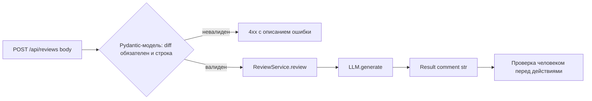

# ADR: решение для первого рабочего сценария

- Статус: proposed
- Дата: 2026-09-08
- Ответственные: инженер, ответственный за `app/api.py` и `app/review_service.py` (конкретное имя не указано в diff — допущение)

## Контекст

Эндпоинт `POST /api/reviews` (TRAINING_PR.diff:35-37) принимает `payload["diff"]` без проверки наличия и типа ключа. При отсутствии/некорректном `diff` возникает необработанный `KeyError`, транслируемый FastAPI в HTTP 500 без диагностики для клиента (TRAINING_PR.diff:36-37, см. `problem.md`). Это первая и наиболее однозначно подтверждённая diff проблема из найденного списка.

## Решение

Добавить явную валидацию входного тела запроса на уровне эндпоинта (Pydantic-модель с обязательным строковым полем `diff` вместо `payload: dict`) до передачи данных в `ReviewService.review`. При невалидном входе FastAPI должен возвращать 4xx с описанием ошибки, а не допускать `KeyError` до вызова сервиса.

## Рассмотренные альтернативы

| Альтернатива | Почему не выбрали сейчас |
|---|---|
| Ручная проверка `if "diff" not in payload` внутри `create_review` с явным `raise HTTPException(400, ...)` | Работает, но не даёт автоматической OpenAPI-схемы и требует дублирования проверки типа для каждого нового поля |
| Обернуть весь эндпоинт в общий middleware-обработчик ошибок, ловящий `KeyError` глобально | Скрывает конкретную причину ошибки для конкретного эндпоинта и не проверяет тип `diff`, только наличие |
| Ничего не менять, оставить как есть | Оставляет открытым найденный в diff риск: 500 вместо понятной ошибки — противоречит цели данного ADR |

## Последствия и главный риск

- Положительные последствия: клиент получает понятную 4xx-ошибку вместо 500; поведение эндпоинта становится документируемым через OpenAPI-схему Pydantic-модели.
- Ограничения: решение покрывает только проблему валидации входа (TRAINING_PR.diff:36-37); не устраняет отсутствие обработки ошибок `llm.generate`, отсутствие лимита длины `diff` и отсутствие авторизации — это отдельные проблемы из списка, требующие отдельных ADR/инкрементов.
- Главный риск: без явного лимита длины `diff` даже валидный по типу вход может быть избыточно большим и вызвать проблему на стороне LLM (TRAINING_PR.diff:20) — это не решается текущим ADR.
- Как проверим риск: integration-тест с очень длинным значением `diff`, наблюдение за поведением/ошибками вызова `llm.generate` (см. `tests_integration.md`, `tests_load.md`); если риск подтвердится, потребуется отдельный ADR на лимит длины входа.

## Архитектурная схема

## Как использовали AI

- Для чего: предложить архитектурное решение и альтернативы для устранения проблемы отсутствия валидации входа эндпоинта `/api/reviews`.
- Тип промпта: master prompt.
- Строка в [`prompts.md`](prompts.md): P1-03.
- Что проверили и исправили сами: ADR ограничен одной конкретной проблемой (валидация входа), не смешан с остальными найденными проблемами (обработка ошибок LLM, лимит длины, авторизация), чтобы решение оставалось малым и проверяемым; риск не преувеличен — явно указано, что решение не покрывает лимит длины diff.
