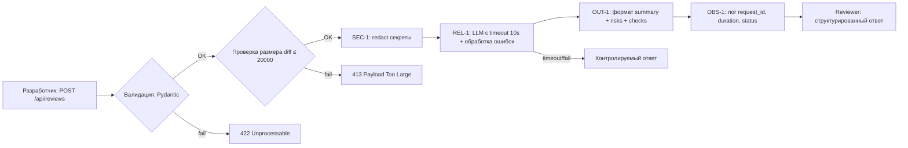

# Анализ процесса: AS IS и TO BE

## AS IS

**Участники:** backend-разработчик (отправитель diff), code reviewer (получатель отчёта), внешний LLM (анализатор).

**Задержки и ручные операции:**
1. Разработчик вручную копирует diff в `payload["diff"]` без проверки структуры (app/api.py:36-37).
2. ReviewService формирует prompt `f"Review this...:\n{diff}"` и сразу вызывает LLM без таймаута (app/review_service.py:20-21).
3. Любая ошибка LLM → 500, отзыв получает пустой ответ, а не контролируемую ошибку (REL-1).
4. Reviewer получает сырой текст `{"comment": answer}` (app/review_service.py:16) — нет структуры для автоматической обработки (OUT-1).
5. Нет логирования — невозможно отследить request_id, задержку или статус (OBS-1).

**Точки потери информации:**
- SEC-1: секреты из diff попадают в LLM без очистки.
- API-1: большой diff не отклоняется на этапе входа.
- QA-1: риски не привязываются к конкретным строкам diff или правилам.

## TO BE

## Разница

| Что меняется | AS IS | TO BE | Как проверим изменение |
|---|---|---|---|
| Валидация входа | `payload["diff"]` без проверки, KeyError → 500 | Pydantic-модель ReviewRequest, 422 при ошибке | tests_unit.md: payload без diff → 422 |
| Размер diff | без лимита | ≤ 20 000 символов (API-1), иначе 413 | tests_e2e.md: diff 20 001 символ → 413 |
| Очистка секретов | секреты передаются в LLM | SEC-1: удаление token/password/key перед LLM | tests_unit.md: diff с token → [REDACTED] в prompt |
| Таймаут LLM | без таймаута | 10 секунд (REL-1), ошибка → контролируемый ответ | tests_integration.md: LLM timeout → контролируемый ответ |
| Формат ответа | `{"comment": answer}` — сырой текст | `summary`, `risks` (max 3), `checks` (OUT-1) | tests_unit.md: ответ соответствует OUT-1 |
| Логирование | отсутствует | `request_id`, `duration`, `status` (OBS-1) | tests_unit.md: лог содержит ровно 3 поля, без содержимого diff |
| Обработка ошибок | необработанные исключения → 500 | try/except → контролируемый ответ | tests_unit.md: LLM raise → контролируемый ответ |

## Как использовали AI

- Для чего: моделирование процесса ревью до и после исправления на основе правил репозитория
- Тип промпта: zero-shot (P1-01), затем уточнение с master prompt (P1-02)
- Строка в `prompts.md`: P1-01, P1-02
- Что проверили и исправили сами: сверили этапы TO BE с каждым правилом из CASE.md (SEC-1, API-1, REL-1, OUT-1, OBS-1)
