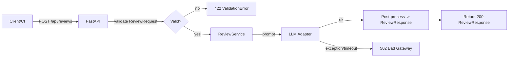

# Анализ процесса: AS IS и TO BE

Файл ведёт OpenCode. Анализ основан на TRAINING_PR.diff.

## AS IS

- Пользователь отправляет POST /api/reviews с произвольным JSON. Нет Pydantic-схемы, доступ к payload["diff"]. При отсутствии ключа — KeyError и 500.
- ReviewService формирует текстовый prompt и вызывает llm.generate(prompt). Ошибки провайдера не перехватываются, возвращается 500.
- Ответ API — непрописанный dict {"comment": str}, без ограничений и метаданных.

## TO BE

- Ввод и вывод валидируются Pydantic-моделями ReviewRequest/ReviewResponse, FastAPI использует response_model.
- Ошибки валидации возвращают 422 с деталями; сетевые/таймаут ошибки LLM маппятся на 502 с кодом и сообщением.
- Ответ структурирован: summary и список рисков с rule/evidence/check и не более 3 элементов.

## Разница

| Что меняется | AS IS | TO BE | Как проверим изменение |
|---|---|---|---|
| Валидация входа | Отсутствует, dict | Pydantic ReviewRequest | pytest: некорректный JSON -> 422 |
| Контракт ответа | Свободный dict | ReviewResponse + response_model | pytest: схема и типы полей |
| Обработка LLM ошибок | Исключение -> 500 | Перехват и 502 | мок LLM: raise -> 502 |
| Ограничение рисков | Нет | ≤3, каждый со структурой | unit: нормализация результата |

## Как использовали AI

- Для чего: формализовать процесс и различия AS IS vs TO BE, выбрать статусы и схему.
- Тип промпта: master prompt с требованиями к доказуемости.
- Строка в [`prompts.md`](prompts.md): P1-02, P1-03.
- Что проверил студент и какие исправления поручил агенту: уточнены статусы 422/502, согласованы поля моделей и проверки.
