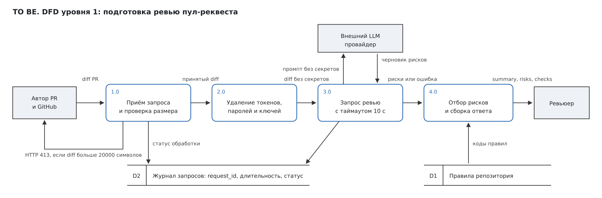

# Анализ процесса: AS IS и TO BE

## AS IS

Опишите текущий процесс от события до результата. Укажите участников, задержки, ручные операции и точки потери информации.

Событие — автор открывает пул-реквест. Дальше PR попадает в очередь и ждёт, пока у назначенного ревьюера освободится окно между собственными задачами. Это первая и самая длинная задержка, и сейчас её никто не измеряет.

Ревьюер открывает diff и читает его целиком вручную. Правила репозитория `SEC-1`…`OBS-1` нигде не выражены в проверяемом виде, поэтому сверка идёт по памяти. Полнота ревью зависит от того, насколько человек помнит список правил и сколько внимания у него осталось к концу длинного diff.

Результат — комментарии свободной формы. Часть из них содержит ссылку на строку, часть сводится к общим формулировкам вроде «добавьте обработку ошибок». Автор правит то, что понял, и цикл повторяется.

Точки потери информации в этом процессе три. Правила живут в головах, а не в проверяемом артефакте. Основание замечания часто не записано, поэтому автор не может отличить требование репозитория от личного вкуса ревьюера. Факт пропуска правила становится виден только тогда, когда проблема доходит до основной ветки, и связать её с конкретным ревью уже трудно.

## TO BE

Опишите один небольшой процесс после изменения. Используйте BPMN, DFD или IDEF*. Если выбранный формат не рендерится в GitHub, положите рядом исходник и PNG, а здесь добавьте ссылки.

Меняется один небольшой участок — подготовка ревью до того, как за diff садится человек. Решение о комментариях и мерже остаётся за ревьюером, это требование `SCOPE-1`.

Нотация — DFD уровня 1. GitHub не рендерит DFD, поэтому ниже PNG, а рядом лежит исходник [`analysis_dfd.svg`](analysis_dfd.svg).

Внешние сущности — автор PR вместе с GitHub, внешний LLM-провайдер и ревьюер. Запуск процесса даёт вебхук GitHub об открытии пул-реквеста, а не ручной запрос ревьюера: разбор готовится заранее, к моменту, когда ревьюер сядет за PR. Процессы 1.0–4.0 — шаги сервиса. Хранилище D1 содержит правила репозитория, по которым процесс 4.0 отбирает риски. В хранилище D2 попадают только `request_id`, длительность и статус, содержимое diff и ответа модели туда не пишется, как требует `OBS-1`.

Ветки отказа на схеме показаны потоками данных, а не условиями: превышение размера возвращается автору как HTTP 413 и до внешнего вызова не доходит, а истёкший таймаут превращается в контролируемую ошибку на входе процесса 4.0. Способ проверить каждую из них указан в таблице «Разница» ниже.

Ревьюер начинает работу не с чистого diff, а с коротким списком подтверждённых рисков и проверок. Правила перестают быть устной договорённостью и становятся шагами процесса, которые видно на схеме.

## Разница

| Что меняется | AS IS | TO BE | Как проверим изменение |
|---|---|---|---|
| Сверка с правилами репозитория | по памяти ревьюера, полнота не гарантирована | механический шаг до чтения человеком | доля ответов, прошедших валидацию `OUT-1`, и ежемесячный аудит выборки PR |
| Секреты внутри diff | уходят во внешний сервис как есть, строка `app/review_service.py:14` | удаляются до вызова LLM по `SEC-1` | передать diff с тестовым токеном и убедиться, что в промпте остался `[REDACTED]` |
| Размер входа | не ограничен, любой diff идёт в LLM | больше 20000 символов отклоняется с HTTP 413 | запрос с diff на 25000 символов возвращает 413 и не доходит до LLM |
| Отказ внешнего вызова | не обработан, ошибка выходит как 500 | таймаут 10 секунд и контролируемый ответ по `REL-1` | заглушка LLM, которая молчит 11 секунд, отдаёт контролируемый ответ, а не 500 |
| Форма замечания | свободный текст, основание часто не записано | `risks` с полями `file`, `line`, `evidence`, не более трёх | автоматическая валидация схемы ответа |
| Кто принимает решение | ревьюер | ревьюер, без изменений | в ответе сервиса нет полей approve и merge |

## Как использовали AI

- Для чего: черновик описания AS IS и TO BE и построение DFD уровня 1
- Тип промпта: R.C.T.F.
- Строка в [`prompts.md`](prompts.md): `P1-04`
- Что проверили и исправили сами: решил оставить одну схему вместо двух, чтобы не поддерживать дубликат при правках. Потребовал перенести подпись HTTP 413 под стрелку, иначе линия её перечёркивала. Проверил рендер в VS Code. Уточнил триггер процесса: запуск даёт вебхук GitHub об открытии PR, а не ручной запрос ревьюера. Привёл номер строки в таблице разницы к координатам изменённого файла, как требует контракт
