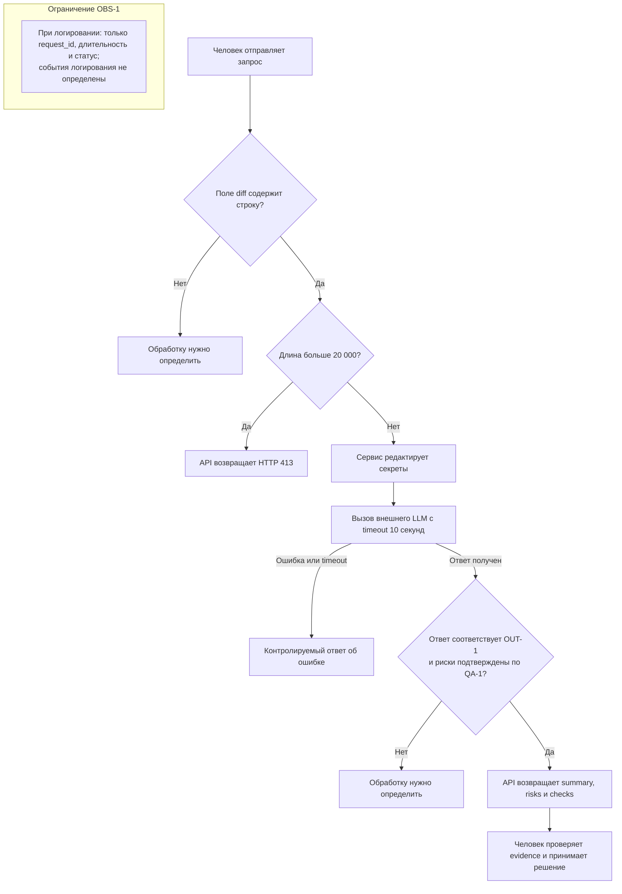

# Анализ процесса: AS IS и TO BE

Файл ведёт OpenCode. Обсудите с агентом содержание и проверьте предложенный diff. Все дополнения и исправления поручайте агенту в чате.

## AS IS

1. Человек-ревьюер инициирует ревью, передавая diff через `POST /api/reviews`. Конкретный клиент, из которого отправляется HTTP-запрос, в источниках не указан.
2. Endpoint принимает тело как обычный `dict` и напрямую обращается к `payload["diff"]`. Если поля нет, возникает `KeyError` до вызова сервиса; если значение не является строкой, показанный код не отклоняет его на входе.
3. API без показанных в diff проверок размера и содержимого передаёт полученное значение в `ReviewService`.
4. `ReviewService` целиком добавляет diff в prompt и синхронно вызывает внешний LLM. Ограничение времени и контролируемая обработка ошибки в изменении не показаны, поэтому внешний вызов является точкой возможной задержки или отказа.
5. Произвольный текст LLM преобразуется в объект с единственным полем `comment`. Здесь теряется требуемая структура `summary`, `risks` и `checks`, поэтому происхождение и доказательность отдельных замечаний нельзя проверить автоматически.
6. Человек вручную интерпретирует комментарий и самостоятельно принимает решение по PR. Действия approve, merge или изменение кода сервис не выполняет.

Точки риска и потери информации: секреты могут уйти во внешний LLM вместе с diff; запрос длиннее 20 000 символов не отклоняется до вызова; зависший или ошибочный LLM-вызов не имеет показанной контролируемой ветви; структурированные риски и проверки сворачиваются в `comment`.

### Участники и границы ответственности

| Участник | AS IS | TO BE | Источник или статус |
|---|---|---|---|
| Человек-ревьюер | Инициирует запрос, вручную интерпретирует `comment` и принимает решение по PR | Проверяет evidence и рекомендации; решение и действия с PR остаются за ним | Роль задана в [`README.md`](README.md); граница полномочий — `SCOPE-1` в [`context.md`](context.md) |
| FastAPI endpoint | Извлекает `payload["diff"]`, передаёт его сервису и возвращает результат | Должен обеспечить отклонение diff длиннее 20 000 символов с HTTP 413 до вызова LLM | AS IS: `app/api.py:8–10`; TO BE: `API-1`. Конкретное место реализации проверки не определено |
| `ReviewService` | Добавляет исходный diff в prompt, вызывает LLM и оборачивает ответ в `comment` | До внешнего вызова должны выполняться редактирование секретов и ограничение времени; результат должен соответствовать `OUT-1` и `QA-1` | AS IS: `app/review_service.py:13–16`; TO BE: Context Pack. Распределение проверок между компонентами не определено |
| Внешний LLM | Получает сформированный prompt и возвращает строку | Возвращает предложение для проверки системой и человеком, но не принимает решение по PR | Вызов виден в `app/review_service.py:15`; граница решения задана `SCOPE-1` |

## TO BE

Целевой процесс ограничен подготовкой рекомендации для человека. Он не включает автоматическое изменение кода или решение по PR. Схема показывает требуемую последовательность, но не назначает новый компонент-владелец проверок. Формат контролируемого ответа при ошибке LLM и поведение при ответе, не соответствующем `OUT-1`, пока не определены.

До проверки размера нужно определить поведение для запроса без строкового поля `diff`. Перед внешним вызовом сервис отклоняет чрезмерный вход и удаляет секреты. Вызов ограничивается десятью секундами; ошибка вызова становится контролируемым ответом. Успешный ответ проходит проверку структуры и доказательности, после чего человек получает рекомендацию. Если ответ не соответствует `OUT-1` или `QA-1`, дальнейшее поведение нужно определить отдельно. При логировании разрешены только `request_id`, длительность и статус; обязательные события источниками не заданы.

## Разница

| Что меняется | AS IS | TO BE | Как проверим изменение |
|---|---|---|---|
| Контракт поля `diff` | Endpoint напрямую читает `payload["diff"]`; отсутствующее поле вызывает `KeyError`, а тип не проверяется показанным кодом | Наличие, тип и ответ на невалидный ввод нужно определить до дальнейшей обработки | Отправить `{}` и `{"diff": null}`, зафиксировать текущий результат и отсутствие согласованного ожидаемого ответа |
| Ограничение входа (`API-1`) | Размер diff не проверяется в показанном endpoint | Diff длиннее 20 000 символов отклоняется до LLM-вызова | Отправить 20 001 символ: получить HTTP 413 и ноль вызовов mock LLM |
| Защита секретов (`SEC-1`) | Исходный diff целиком включается в prompt | Токены, пароли и приватные ключи заменяются до внешнего вызова | Передать тестовые маркеры трёх типов: в prompt есть `[REDACTED]`, исходных значений нет |
| Надёжность LLM-вызова (`REL-1`) | Timeout и контролируемая ошибка не показаны | Вызов ограничен 10 секундами, timeout и ошибка дают контролируемый ответ | Настроить mock LLM на задержку более 10 секунд и на исключение |
| Контракт результата (`OUT-1`, `QA-1`) | Возвращается единственное поле `comment` | Возвращаются `summary`, `risks` и `checks`; рисков не больше трёх, у каждого есть `file`, `line`, `evidence`, `risk` | Проверить схему и evidence каждого риска |
| Наблюдаемость (`OBS-1`) | Логирование в diff не показано | Если создаётся лог, в него попадают только `request_id`, длительность и статус; обязательные события пока не определены | Перехватить создаваемые логи: содержимого diff и ответа LLM нет, других полей нет |

## Карта источников

| Часть процесса | Утверждение | Тип | Подтверждение | Статус |
|---|---|---|---|---|
| Приём запроса | Endpoint принимает `dict` и читает `payload["diff"]` без показанной проверки | AS IS | [`TRAINING_PR.diff`](TRAINING_PR.diff), `app/api.py:8–10` | Подтверждено diff |
| Подготовка prompt | Исходный diff добавляется в prompt и передаётся LLM | AS IS | [`TRAINING_PR.diff`](TRAINING_PR.diff), `app/review_service.py:13–15` | Подтверждено diff |
| Защита входа и надёжность | Секреты удаляются, большой diff получает HTTP 413, вызов ограничен 10 секундами | TO BE | [`context.md`](context.md), `SEC-1`, `API-1`, `REL-1` | Подтверждено Context Pack |
| Результат и решение | Ответ содержит `summary`, до трёх доказуемых `risks` и `checks`; решение остаётся за человеком | TO BE | [`context.md`](context.md), `OUT-1`, `QA-1`, `SCOPE-1` | Подтверждено Context Pack |
| Ошибки входа, невалидный ответ и логирование | Формат ответа для нестрокового `diff`, обработка нарушения `OUT-1` и события создания логов | Неизвестно | В diff и Context Pack решения нет; `OBS-1` определяет только допустимые поля | Требуется решение человека |

## Как использовали AI

- Для чего: последовательно улучшить модель процесса шестью техниками и проверить её по доступным источникам.
- Тип промпта: Few-shot, R.C.T.F., Chain of Verification, Tree of Thoughts, RAG и ReAct.
- Строка в [`prompts.md`](prompts.md): P1-03; подробный журнал — в [`../practice_02/prompts.md`](../practice_02/prompts.md).
- Что проверил студент и какие исправления поручил агенту: факты AS IS сверены с [`TRAINING_PR.diff`](TRAINING_PR.diff), требования TO BE — с [`context.md`](context.md); неподтверждённые контракты отмечены как неизвестные.
