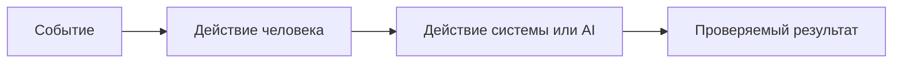

# Анализ процесса: AS IS и TO BE

Файл ведёт OpenCode. Обсудите с агентом содержание и проверьте предложенный diff. Все дополнения и исправления поручайте агенту в чате.

## AS IS

Расскажите OpenCode о текущем процессе. Попросите агента описать участников, задержки, ручные операции и точки потери информации.

Участники: разработчик, ревьюер, сервис `ReviewService` с абстракцией `LLM`, HTTP API.

Процесс сейчас (согласно diff):
- Обработчик принимает аргумент `payload: dict` и извлекает ключ `diff`.
- `ReviewService.review` формирует prompt со вставкой `diff` и вызывает `LLM.generate`.
- Возвращается словарь, содержащий ключ `comment` со значением ответа `LLM.generate`.

Задержки и ручные операции:
- В доступных файлах отсутствует информация о механизмах ограничения времени или очередях; детали неизвестны.
- Проверка результата человеком описана схематично (см. диаграммы), но конкретика вне diff отсутствует.

Точки риска/потери информации:
- Нет явной схемы запроса/ответа и валидации во фрагментах diff; при отсутствии ключа `diff` возможны необработанные исключения.
- Отсутствуют сведения о трассировке/логах в доступных файлах.

## TO BE

Обсудите с OpenCode один процесс после изменения. Поручите агенту описать его в BPMN, DFD или IDEF*. Если GitHub не отображает выбранный формат, агент сохраняет рядом исходник и PNG и добавляет ссылки.

Конкретизация TO BE (направления, без утверждений о реализационных деталях):
- Ввести явное описание контракта запроса/ответа и валидацию входа.
- Добавить обработку исключений при обращении к LLM и при отсутствии ключа `diff`.
- Определить минимальные требования к наблюдаемости (трассировка/логи) по согласованию.

## Разница

| Что меняется | AS IS | TO BE | Как проверим изменение |
|---|---|---|---|
| Валидация входа | Извлечение ключа без проверки | Явное описание и проверка контракта | Сценарий с отсутствующим ключом diff |
| Обработка ошибок LLM | Не видна в diff | Добавить обработку исключений | Мок LLM, выбрасывающий исключение |
| Наблюдаемость | Не видна в diff | Определить требования | Ревью логов/метаданных |

## Как использовали AI

- Для чего: зафиксировать текущее состояние и желаемые изменения процесса в терминах рисков и проверок.
- Тип промпта: task design на основе master prompt.
- Строка в [`prompts.md`](prompts.md): P1-03.
- Что проверил студент и какие исправления поручил агенту: подтвердил узкие места и запросил проверяемые сценарии и метрики для сравнения AS IS и TO BE.
