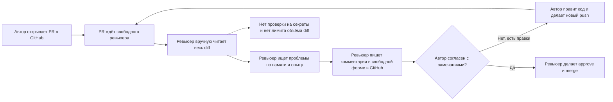
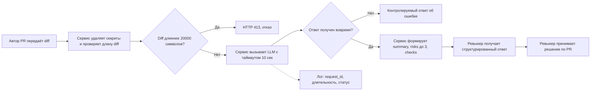

# Анализ процесса: AS IS и TO BE

## AS IS

В CASE.md статистика процесса ревью PR до появления сервиса-помощника не приводится. Ниже описан процесс ревью PR без AI-помощника: автор открывает PR, ревьюер вручную читает diff, ищет проблемы по памяти и пишет комментарии в GitHub, автор правит код, цикл повторяется. Тайминги и загрузка команды — допущение для типичной команды из 5 разработчиков с 10–15 PR в неделю.

Участники: автор PR (пишет код, вносит правки по замечаниям) и ревьюер PR (человек; вручную анализирует diff, пишет комментарии, сам же принимает решение — approve/merge или запрос правок).

Шаги:

1. Автор открывает PR в GitHub с готовым diff.
2. PR становится в очередь на ревью; свободный ревьюер находится не сразу — он занят другими задачами или другими PR (допущение: при 5 разработчиках и 10–15 PR в неделю на человека приходится несколько параллельных PR).
3. Ревьюер вручную читает весь diff целиком без ограничения по объёму: длинный diff не отклоняется и не сокращается (аналога `API-1` нет).
4. Ревьюер ищет проблемы по памяти и личному опыту — обязательного чек-листа или набора проверок нет; какие правила репозитория проверяются, зависит от конкретного ревьюера.
5. Ревьюер пишет комментарии в свободной форме прямо в GitHub — единого формата нет: не для каждого замечания указаны файл, строка и доказательство (аналога `OUT-1`/`QA-1` нет).
6. Автор читает комментарии и либо вносит правки и делает новый push (цикл возвращается к шагу 2 — ревьюер снова должен найти время), либо ревьюер сразу согласен с изменениями.
7. Когда у ревьюера не остаётся замечаний, он сам выполняет approve и merge — разделения на «совет» и «решение» нет, ревьюер отвечает и за поиск проблем, и за итоговое решение.

Узкие места:

- Время ожидания ревьюера: до первого комментария может проходить от нескольких часов до дня и больше, потому что ревьюер занят другими задачами; ориентир для команды из 5 разработчиков и 10–15 PR в неделю — 3–6 часов на PR среднего размера (допущение).
- Неполнота проверки: проверка идёт по памяти без чек-листа, поэтому разные ревьюеры находят разные подмножества проблем; часть нарушений правил репозитория (например, случаев, аналогичных `SEC-1` или `QA-1`) может остаться незамеченной.
- Отсутствие единого формата замечаний: комментарии в GitHub пишутся свободно, без обязательной ссылки на файл/строку/доказательство — часть комментариев по стилю ближе к «плохому» примеру из CASE.md («Код можно улучшить»), чем к «хорошему» с конкретной строкой и правилом.
- Нет следа проверки: комментарии разбросаны по веткам обсуждения PR в GitHub, нет записи о том, какие правила репозитория проверялись и проверялись ли вообще, поэтому качество ревью зависит от конкретного человека и не воспроизводится.

## TO BE

Шаги:

1. Автор PR передаёт diff.
2. Сервис удаляет из diff токены, пароли и приватные ключи перед обращением к внешнему LLM (`SEC-1`).
3. Сервис проверяет длину diff; если он длиннее 20 000 символов — запрос отклоняется с HTTP 413 (`API-1`).
4. Сервис вызывает внешний LLM с таймаутом 10 секунд (`REL-1`).
5. Если ответ не получен вовремя или произошла ошибка, сервис возвращает контролируемый ответ вместо необработанного сбоя (`REL-1`).
6. Если ответ получен, сервис формирует результат в формате `summary`, `risks` (не более трёх, каждый с `file`, `line`, `evidence`, `risk`) и `checks` (`OUT-1`); риск включается только если подтверждён строкой diff или правилом репозитория (`QA-1`).
7. В лог записываются только `request_id`, длительность и статус вызова — без содержимого diff и ответа модели (`OBS-1`).
8. Ревьюер получает структурированный ответ и сам принимает решение по PR; сервис не выполняет approve, merge и не меняет код (`SCOPE-1`).

## Разница

| Что меняется | AS IS | TO BE | Как проверим изменение |
|---|---|---|---|
| Поиск проблем в diff | Ревьюер вручную читает весь diff и ищет проблемы по памяти, без чек-листа | Сервис формирует `summary` и до трёх `risks` автоматически при каждом PR (`OUT-1`) | Прогнать `TRAINING_PR.diff` через сервис и сверить, что ответ содержит `summary` и `risks` |
| Удаление секретов из diff | Не выполняется; в процессе ревью в GitHub такого шага нет | Выполняется перед отправкой во внешний LLM (`SEC-1`) | Передать diff с тестовым token и убедиться, что в prompt осталось `[REDACTED]` |
| Ограничение длины diff | Не выполняется; ревьюер читает diff любого объёма | Diff длиннее 20 000 символов отклоняется с HTTP 413 (`API-1`) | Отправить diff длиннее 20 000 символов и получить HTTP 413 |
| Время до первой обратной связи | Ревьюер должен освободиться от других задач; первый комментарий появляется с задержкой (допущение: 3–6 часов) | Ответ сервиса приходит не позже таймаута LLM в 10 секунд (`REL-1`) | Смоделировать зависание LLM-вызова и проверить, что ответ приходит не позже 10 секунд и содержит контролируемую ошибку |
| Формат замечаний | Комментарии в свободной форме в GitHub, без обязательной ссылки на файл/строку/доказательство | `summary`, `risks` (максимум 3, поля `file`, `line`, `evidence`, `risk`), `checks` (`OUT-1`) | Проверить структуру ответа на соответствие `OUT-1` и что `risks` содержит не более трёх элементов |
| Подтверждённость замечаний | Ревьюер сам решает, доверять ли своей находке; проверка неформальна | Риск включается в ответ только при наличии подтверждения строкой diff или правилом (`QA-1`) | Для каждого риска в ответе найти соответствующую строку diff или правило репозитория |
| Логирование | Не регламентировано; общение может проходить вне рабочих логов | Логируются только `request_id`, длительность и статус; diff и ответ модели не логируются (`OBS-1`) | Проверить содержимое лог-записи после вызова сервиса |
| Кто принимает решение по PR | Ревьюер сам ищет проблемы и сам же делает approve/merge | Сервис только советует; решение об approve/merge остаётся за ревьюером (`SCOPE-1`) | Убедиться, что API сервиса не содержит операций записи в GitHub |

## Как использовали AI

- Для чего: черновик AS IS/TO BE процесса и диаграмм Mermaid по фактам из CASE.md.
- Тип промпта: master prompt (роль, входы, задача и артефакты, формат, границы, шаги, проверка перед выдачей заданы явно).
- Строка в [`prompts.md`](prompts.md): P1-03 (генерация артефактов master prompt'ом).
- Что проверили и исправили сами: сверили каждый шаг TO BE с конкретным правилом (`SEC-1`, `API-1`, `REL-1`, `OUT-1`, `QA-1`, `OBS-1`, `SCOPE-1`); для AS IS, где статистика по процессу ревью до сервиса в CASE.md не приведена, явно пометили допущения словом «(допущение)» вместо TODO.
