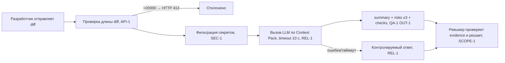

# Анализ процесса: AS IS и TO BE

## AS IS

Текущий процесс ревью PR с участием AI-сервиса (`app/review_service.py`, `app/api.py`):

1. Разработчик создаёт PR и просит ревью; в очередь ревьюера встаёт новый diff.
2. Ревьюер и/или разработчик вызывает сервис: `POST /api/reviews` с `{"diff": ...}`.
3. Сервис без проверок вставляет diff в f-string и отправляет его во внешний LLM (`review_service.py`, prompt строится строкой прямо из diff).
4. LLM возвращает произвольный текст; сервис оборачивает его в `{"comment": answer}` без структуры.
5. Если LLM медленный или отвечает ошибкой — синхронный вызов без таймаута блокирует воркер; ошибка не перехватывается → HTTP 500.
6. Ревьюер получает общий текст без `file:line`, без evidence и без проверок и сам ищет строки и риски; секреты из diff при этом уже ушли во внешний LLM.
7. Решение о merge принимает человек вручную, на основе неполного и недоказанного анализа.

Точки потери информации и риски:

- Diff уходит во внешний LLM без фильтрации секретов (SEC-1 нарушен).
- Нет проверки длины diff (>20 000 символов не отклоняется, API-1 нарушен).
- Синхронный вызов без timeout 10 с и без контролируемой обработки ошибки (REL-1 нарушен).
- Результат неструктурированный — непригоден для программного потребления и решения человека (OUT-1 нарушен).

## TO BE

Целевой процесс ревью PR с помощником ревьюера:

1. Разработчик создаёт PR и отправляет diff в сервис: `POST /api/reviews` с `{"diff": ...}`.
2. Сервис проверяет длину diff: если больше 20 000 символов — отклоняет с HTTP 413 (API-1).
3. Сервис фильтрует diff: токены, пароли и приватные ключи → `[REDACTED]` (SEC-1).
4. Сервис вызывает внешний LLM по Context Pack с timeout 10 с; при ошибке или таймауте возвращает контролируемый ответ, а не 500 (REL-1).
5. LLM возвращает `summary` + не более трёх `risks` с `file`/`line`/`evidence`/`risk` + массив `checks`; риск включается только при подтверждении строкой diff или правилом (QA-1, OUT-1).
6. Ревьюер проверяет каждый риск по evidence и воспроизводимым check'ам и принимает решение сам; сервис не approve, не merge и не правит код (SCOPE-1).
7. В лог пишутся только `request_id`, длительность и статус; содержимое diff и ответа модели не логируется (OBS-1).

## Разница

| Что меняется | AS IS | TO BE | Как проверим изменение |
|---|---|---|---|
| Приём diff на входе | diff принимается без проверки длины и секретов | длина >20 000 отклоняется с 413 (API-1); секреты → `[REDACTED]` (SEC-1) | POST diff длиной 25 000 символов → ожидать 413; POST diff с тестовым token → в prompt `[REDACTED]` |
| Обработка отказа LLM | синхронный вызов без таймаута, ошибка → HTTP 500, воркер блокируется | timeout 10 с, ошибка → контролируемый ответ (REL-1) | мок LLM, который спит/падает → ожидать контролируемый ответ, не 500 |
| Результат | произвольный текст в `{"comment": ...}` | `summary` + `risks` (≤3, `file`/`line`/`evidence`/`risk`) + `checks` (OUT-1) | проверить ключи JSON ответа; риски сверять с diff/правилами (QA-1) |
| Роль человека и AI | ревьюер вручную ищет строки и риски; сервис «советует» без гарантий | helper отдаёт подтверждённые риски с проверками; решение — только человек (SCOPE-1) | e2e-сценарий: человек подтверждает/отклоняет каждый риск перед merge |
| Наблюдаемость | содержимое diff и ответа не логируется, но и диагностики нет | лог только `request_id`/длительность/статус (OBS-1) | проверить записи лога на отсутствие содержимого diff/ответа |

## Как использовали AI

- Для чего: описать текущий (AS IS) и целевой (TO BE) процесс ревью PR с помощником на основе TRAINING_PR.diff
- Тип промпта: zero-shot (P1-01), master prompt (P1-02)
- Строка в [`prompts.md`](prompts.md): P1-01, P1-02
- Что проверили и исправили сами: каждый шаг TO BE привязан к правилам Context Pack (SEC-1…OBS-1); в AS IS и TO BE нет придуманных шагов, отсутствующих в diff