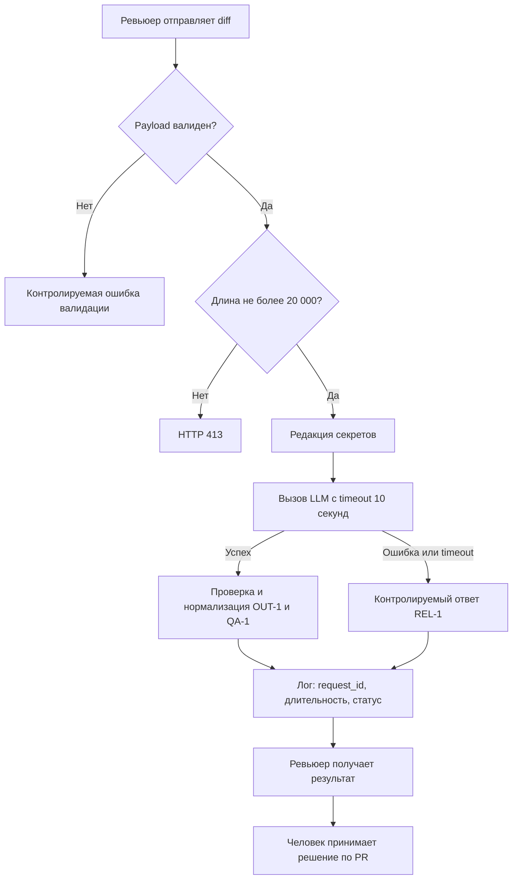

# Анализ процесса: AS IS и TO BE

## AS IS

1. Ревьюер или разработчик передаёт `diff` в `POST /api/reviews`.
2. FastAPI-обработчик принимает произвольный `dict` и читает `payload["diff"]`. Если поля нет, запрос завершается необработанной ошибкой вместо предсказуемого клиентского ответа.
3. `ReviewService` целиком подставляет исходный diff в prompt. Секреты не редактируются, а длина diff не проверяется.
4. Сервис синхронно вызывает внешний LLM без таймаута. Ошибка или зависание провайдера не преобразуется в контролируемый ответ.
5. Текст LLM возвращается как `{"comment": "..."}`. Формат нельзя автоматически обработать по OUT-1, а доказательность рисков по QA-1 не проверяется.
6. Ревьюер вручную интерпретирует свободный текст и решает, какие проверки запускать. Решение по PR остаётся за человеком, что соответствует SCOPE-1.

Основные точки потери информации и задержки: отсутствие структурированных `risks` и `checks`, неограниченное ожидание внешнего LLM и ручное извлечение рекомендаций из свободного текста. Точки отказа: невалидный payload, diff больше лимита, утечка секрета, таймаут или исключение LLM.

## TO BE

Целевой процесс представлен flowchart-диаграммой: она показывает основной путь, ранние отказы и границу между автоматической рекомендацией и решением человека.

В TO BE система отклоняет некорректный или слишком большой вход до вызова LLM, редактирует секреты, ограничивает ожидание десятью секундами и возвращает машинно-проверяемый результат. Содержимое diff и ответа LLM не попадает в лог по OBS-1.

## Разница

| Что меняется | AS IS | TO BE | Как проверим изменение |
|---|---|---|---|
| Приём входа | Произвольный `dict`, возможен `KeyError`; лимита нет | Явная схема; diff длиннее 20 000 символов получает 413 | Integration-тесты отсутствующего поля, границ 20 000/20 001 |
| Передача данных в LLM | Исходный diff отправляется целиком | Токены, пароли и приватные ключи заменяются на `[REDACTED]` | Unit-тест редактора и проверка prompt в fake LLM |
| Работа с LLM | Нет таймаута и обработки исключений | Таймаут 10 секунд; сбой превращается в контролируемый ответ | Fake LLM с задержкой и исключением |
| Контракт результата | `{"comment": "..."}` | `summary`, `risks` (не более трёх), `checks`; у риска есть evidence | Контрактный тест JSON-схемы и QA-1 |
| Наблюдаемость | Поведение логирования не задано в diff | Только `request_id`, длительность и статус | Захват логов и отрицательная проверка на содержимое diff/ответа |
| Решение по PR | Ручное | По-прежнему принимает человек; сервис только советует | Проверка отсутствия операций approve, merge и изменения кода |

## Как использовали AI

- Для чего: описать фактический и целевой процессы обработки diff и связать изменения с проверками.
- Тип промпта: контекстный анализ AS IS / TO BE.
- Строка в [`prompts.md`](prompts.md): P1-06.
- Что проверили и исправили сами: отделили факты из `TRAINING_PR.diff` от целевого решения из ADR; сохранили решение за человеком по SCOPE-1 и не добавляли auth/rate limiting вне заданного scope.
