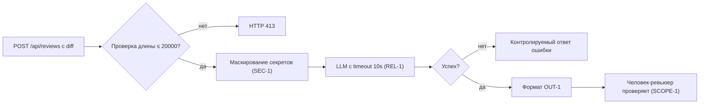

# Анализ процесса: AS IS и TO BE

## AS IS

Событие: разработчик отправляет diff PR в сервис для первичного анализа.

Участники: Разработчик/ревьюер, веб-API сервиса, внешний LLM.

Поток:
- Разработчик отправляет POST с diff.
- API без валидации длины и типа передаёт diff в сервис.
- Сервис строит prompt, включив сырой diff, и вызывает внешний LLM без таймаута и без редактирования секретов.
- Возврат неструктурированного ответа {"comment": ...}. Ошибки и таймауты приводят к 500.

## TO BE

Малая доработка соблюдает правила SEC-1, API-1, REL-1, OUT-1, QA-1, OBS-1 и оставляет решение за человеком (SCOPE-1):

1) API валидирует тип и длину diff, возвращает 413 при >20000 символов.
2) Сервис маскирует секреты в diff перед формированием prompt.
3) Вызов LLM обёрнут таймаутом 10 секунд; ошибки маппятся в контролируемый ответ.
4) Выход сервиса строго формата OUT-1: summary, до 3 risks с evidence, checks.
5) Логи содержат только request_id, длительность, статус.

## Разница

| Что меняется | AS IS | TO BE | Как проверим изменение |
|---|---|---|---|
| Ограничение длины diff (API-1) | Нет 413 | 413 при >20000 | Интеграционный тест с длинным diff |
| Маскирование секретов (SEC-1) | Сырой diff в prompt | [REDACTED] вместо секретов | Тест с фиктивным токеном |
| Таймаут LLM (REL-1) | Таймаут -> 500 | Таймаут -> контролируемый ответ | Интеграция с искусственной задержкой |
| Формат ответа (OUT-1) | Свободный текст | Структура summary/risks/checks | Авто-валидатор схемы |
| Логи (OBS-1) | Могут включать лишнее | request_id, длительность, статус | Лог-сканер на ключевые поля |

## Как использовали AI

- Для чего: описать целевое состояние процесса для соблюдения правил SEC-1…OBS-1 и минимизировать риск.
- Тип промпта: master prompt для инженерных артефактов.
- Строка в [`prompts.md`](prompts.md): P1-03.
- Что проверили и исправили сами: уточнили шаги, сопоставили с правилами, проверили мермайд-диаграмму на рендер.
