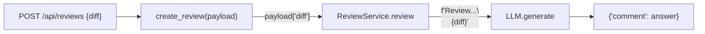
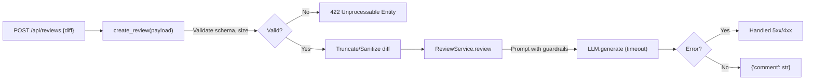

# Анализ процесса: AS IS и TO BE

## AS IS

Текущий процесс извлекаем только из TRAINING_PR.diff.

- Клиент отправляет POST-запрос на эндпоинт `/api/reviews` с JSON-пейлоадом типа `dict` и ключом "diff" (evidence: app/api.py:35-38 — добавлен эндпоинт и обращение к `payload["diff"]`).
- Обработчик напрямую передает `payload["diff"]` в `review_service.review` без валидации и ограничений (evidence: app/api.py:36-38 — нет проверки наличия ключа и типа).
- `ReviewService.review(diff)` формирует промпт `"Review this pull request and find problems:\n{diff}"` и вызывает `self.llm.generate(prompt)` (evidence: app/review_service.py:19-22).
- Ответ LLM возвращается как `{ "comment": answer }` (evidence: app/review_service.py:22) и проксируется наружу (evidence: app/api.py:36-38 — возврат результата сервиса).

Наблюдения по рискам текущего процесса:
- При отсутствии ключа "diff" произойдет KeyError и 500 (evidence: app/api.py:36-38 — прямое обращение к ключу).
- Любой размер и содержимое `diff` попадает в промпт LLM (evidence: app/review_service.py:19-22 — прямое включение строки без ограничений).
- Нет обработки ошибок LLM (evidence: отсутствие try/except в app/api.py:35-38 и app/review_service.py:19-22).

## TO BE

Предлагаемый минимальный процесс с валидацией и ограничениями (best practices, вытекают из выявленных рисков в diff):

- Валидировать вход с помощью схемы: обязательный строковый `diff`, ограничить размер (например, до 100 KB) и возвращать 422 при нарушении контракта.
- Явно ограничить и очищать содержимое `diff` перед включением в промпт (усечение, статические инструкции для LLM).
- Добавить обработку ошибок LLM и таймауты, маппинг в 5xx/4xx.

Диаграмма AS IS

Диаграмма TO BE

## Разница

| Что меняется | AS IS | TO BE | Как проверим изменение |
|---|---|---|---|
| Валидация входа | Нет (прямой доступ к payload["diff"]) | Pydantic-схема, 422 при ошибке | Отправить запрос без ключа/с неверным типом → 422 (evidence: app/api.py:36-38 сейчас 500) |
| Ограничение размера | Нет | Лимит, например 100 KB, 413 при превышении | Отправить >100 KB → 413 (evidence: отсутствуют проверки в app/api.py:36-38) |
| Санитизация промпта | Нет, прямая вставка diff | Усечение/очистка перед LLM | Ввести «злонамеренный» diff → в промпте усеченная/очищенная версия (evidence: прямая вставка в app/review_service.py:19-22) |
| Обработка ошибок LLM | Отсутствует | try/except, маппинг в 5xx/4xx | Смоделировать исключение LLM → контролируемый ответ (evidence: нет обработки в app/review_service.py:19-22) |

## Как использовали AI

- Для чего: Генерация описаний AS IS и TO BE, таблицы различий и диаграмм, строго на основе TRAINING_PR.diff.
- Тип промпта: master prompt (системная инструкция).
- Строка в [`prompts.md`](prompts.md): P1-02.
- Что проверили и исправили сами: Сопоставили каждое утверждение с соответствующими строками diff; исключили предположения вне diff; добавили только best practices в разделе TO BE.
