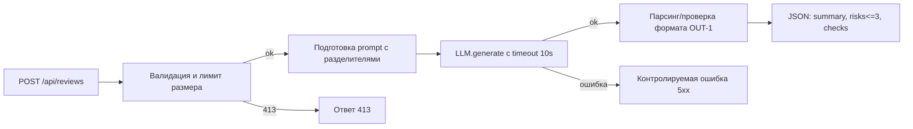

# Анализ процесса: AS IS и TO BE

## AS IS

Сейчас клиент отправляет HTTP POST `/api/reviews` с JSON‑телом без схемы. Обработчик принимает `dict`, обращается к `payload["diff"]` и передаёт строку диффа в `ReviewService.review`. Сервис формирует prompt вида `Review this pull request and find problems:` + raw diff и вызывает `llm.generate`. Ответ возвращается как `{"comment": str}`. Нет валидации входа, нет ограничений на размер диффа, нет обработки ошибок и таймаутов, структура ответа не формализована.

## TO BE

Добавляем минимальные защитные меры и контракт ответа по правилам OUT‑1, API‑1, REL‑1. Ввод валидируем моделью запроса, ограничиваем размер diff (413 при превышении), вызываем LLM с таймаутом и переводом ошибок в контролируемый ответ. Возвращаем структурированный JSON (summary, ≤3 risks, checks).

## Разница

| Что меняется | AS IS | TO BE | Как проверим изменение |
|---|---|---|---|
| Валидация | Отсутствует | Pydantic‑модель запроса | Unit на пустой body ⇒ 422 |
| Лимит размера | Отсутствует | 20 000 символов ⇒ 413 | E2E с большим diff |
| Таймаут | Отсутствует | 10s timeout и контролируемая ошибка | Интеграционный тест с mock LLM |
| Формат ответа | Свободный текст | OUT‑1 JSON | Unit на схему ответа |

## Как использовали AI

- Для чего: описать процесс AS IS/TO BE и измеримые изменения.
- Тип промпта: zero‑shot (идеи), master prompt (уточнение формата и ограничений).
- Строка в [`prompts.md`](prompts.md): P1‑01, P1‑02.
- Что проверили и исправили сами: согласовали блок‑схему и таблицу различий с правилами SEC‑1, API‑1, REL‑1, OUT‑1.
