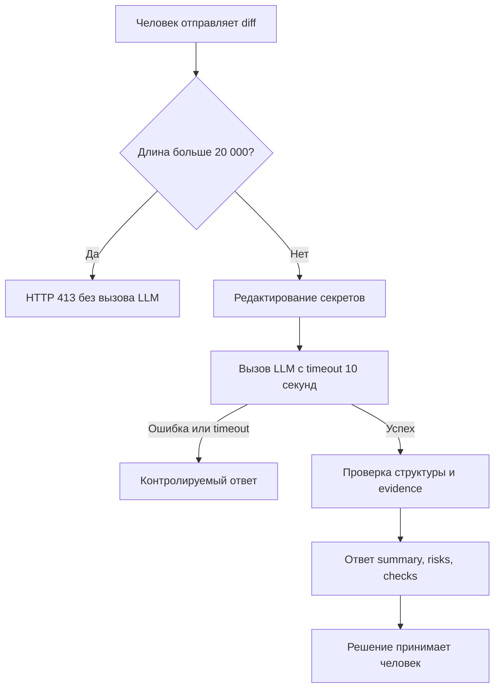

# Анализ процесса: AS IS и TO BE

Файл ведёт OpenCode. Обсудите с агентом содержание и проверьте предложенный diff. Все дополнения и исправления поручайте агенту в чате.

## AS IS

1. Человек-ревьюер отправляет diff через `POST /api/reviews`.
2. Endpoint извлекает `payload["diff"]` и без показанной проверки размера или содержимого передаёт значение в `ReviewService`.
3. `ReviewService` целиком добавляет diff в prompt и синхронно вызывает внешний LLM. Timeout и контролируемая обработка ошибки в diff не показаны.
4. Текст LLM возвращается в единственном поле `comment`, без структуры для summary, рисков и проверок.
5. Человек вручную интерпретирует комментарий и принимает решение по PR.

Основные точки риска: секреты могут уйти во внешний LLM; чрезмерный diff не отклоняется до вызова; внешний вызов может задержаться или завершиться ошибкой; содержание `comment` нельзя проверить по стабильной схеме.

## TO BE

Целевой процесс сначала ограничивает вход и удаляет секреты. Внешний вызов имеет timeout, а его ошибка не превращается в бесконечное ожидание. Успешный ответ содержит до трёх подтверждённых рисков и проверки. Сервис только советует и не выполняет действий с PR.

## Разница

| Что меняется | AS IS | TO BE | Как проверим изменение |
|---|---|---|---|
| Размер входа | Проверки в endpoint нет | Diff длиннее 20 000 символов отклоняется до LLM | Передать 20 001 символ, ожидать HTTP 413 и ноль вызовов mock LLM |
| Секреты | Diff целиком входит в prompt | Токены, пароли и приватные ключи заменяются | Перехватить prompt и проверить `[REDACTED]` вместо тестовых значений |
| Внешний вызов | Timeout и error-ветка не показаны | Timeout 10 секунд и контролируемый ответ | Настроить mock на задержку и исключение; оба запроса должны завершиться |
| Формат ответа | Одно поле `comment` | `summary`, `risks`, `checks`; не более трёх доказуемых рисков | Проверить JSON-схему и evidence каждого риска |
| Полномочия | Ответ интерпретирует человек | Решение и действия с PR явно остаются за человеком | Убедиться, что сервис не вызывает API approve, merge или изменения кода |

## Как использовали AI

- Для чего: восстановить текущий процесс по diff и связать целевые изменения с Context Pack.
- Тип промпта: контекстный master prompt.
- Строка в [`prompts.md`](prompts.md): P1-03.
- Что проверил студент и какие исправления поручил агенту: шаги AS IS сверены с `TRAINING_PR.diff`; из TO BE исключены автоматический merge, неподтверждённый HTTP-статус ошибки LLM и обещания ускорения без baseline.
