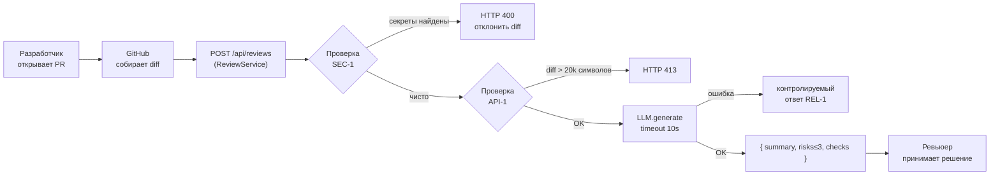

# Анализ процесса: AS IS и TO BE

## AS IS

**Участники:** инженер-ревьюер, GitHub, кодовая база.

**Шаги:**
1. Разработчик открывает PR в GitHub.
2. Ревьюер получает уведомление и открывает diff вручную.
3. Ревьюер построчно читает изменения, самостоятельно ища проблемы безопасности, архитектурные риски и нарушения правил.
4. Ревьюер оставляет комментарии или approves PR.
5. Разработчик исправляет замечания и снова запрашивает ревью.

**Проблемные точки:**
- Шаг 3 — ручной, линейный, зависит от опыта ревьюера; при diff > 200 строк легко пропустить `SEC-1`-нарушение.
- Нет инструмента, проверяющего наличие секретов в diff до отправки в LLM.
- Нет формализованного формата риска (файл, строка, доказательство, проверка).

## TO BE

После добавления `ReviewService` и эндпоинта `POST /api/reviews` процесс ревью получает автоматическую первичную проверку:

## Разница

| Что меняется | AS IS | TO BE | Как проверим изменение |
|---|---|---|---|
| Проверка секретов в diff | Ручная / отсутствует | Автоматически по `SEC-1` до передачи в LLM | Тест с diff, содержащим тестовый token — ожидается `[REDACTED]` |
| Ограничение размера diff | Нет | HTTP 413 для diff > 20 000 символов (`API-1`) | Передать diff длиной 20 001 символ — ожидается 413 |
| Обработка ошибок LLM | 500 без сообщения | Контролируемый ответ с описанием (`REL-1`) | Сымитировать таймаут LLM — ожидается 503 с полем `error` |
| Формат ответа ревью | Произвольный комментарий | Структурированный JSON (`OUT-1`) | Проверить схему ответа: поля `summary`, `risks`, `checks` обязательны |

## Как использовали AI

- Для чего: понимание AS IS-процесса и выявление точек потери информации через zero-shot анализ diff (P1-01).
- Тип промпта: zero-shot (P1-01) — ответ использован для определения проблемных мест.
- Строка в [`prompts.md`](prompts.md): P1-01.
- Что проверили и исправили сами: Mermaid-схема построена вручную по правилам `CASE.md`; все метки в диаграмме сверены с правилами `SEC-1`, `API-1`, `REL-1`, `OUT-1`.
