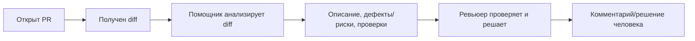

# Анализ процесса: AS IS и TO BE

Файл ведёт OpenCode. Обсудите с агентом содержание и проверьте предложенный diff. Все дополнения и исправления поручайте агенту в чате.

## AS IS

Учебная гипотеза: ревьюер вручную читает diff PR, выявляет риски и предлагает проверки. Процесс занимает время на рутинные шаги, часть базовых дефектов в изменённых фрагментах может проходить незамеченной. Решение всегда принимает человек.

## TO BE

С помощником ревьюер получает структурированный результат: краткое описание, до трёх пунктов (доказанный дефект или потенциальный риск), каждый с подтверждением/обоснованием по diff, и список предложенных проверок. Решение остаётся за человеком.

## Разница

| Что меняется | AS IS | TO BE | Как проверим изменение |
|---|---|---|---|
| Формат входа для ревьюера | Неструктурированная заметка ревьюера | Структурированный отчёт: описание, до 3 пунктов (дефект/риск), проверки | Ручная проверка соответствия формату по ответам помощника |
| Доказательность выводов | Возможны недоказанные предположения | Каждый «дефект» подтверждён цитатой из diff; «риски» помечены как гипотезы | Ручная верификация по diff (метрика: доля подтверждённых рисков) |
| Время первичного ревью | Гипотеза: выше из‑за рутины | Гипотеза: ниже за счёт подсказок | Пилот: сравнить медиану времени (гипотеза −20%, не выдавать за факт) |

## Как использовали AI

- Для чего: описать AS IS/TO BE и проверяемую разницу для учебного кейса.
- Тип промпта: структурированный запрос (Build-сессия).
- Строка в [`prompts.md`](prompts.md): P1-04.
- Что проверил студент и какие исправления поручил агенту: отделение гипотез от фактов; явная маркировка «дефект/риск»; человек в контуре.
