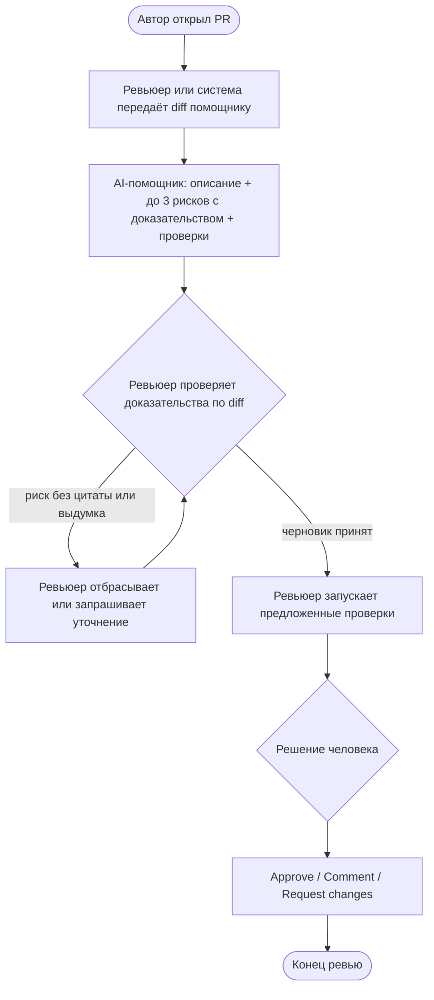

# Анализ процесса: AS IS и TO BE

## AS IS

Участники: автор PR, ревьюер, (опционально) CI.

1. Автор открывает PR с diff.
2. Ревьюер читает diff целиком вручную.
3. Ревьюер сам формулирует замечания и список проверок; структура не фиксирована.
4. Возможны задержки: повторное чтение больших diff, пропуск краевых случаев (нет поля в JSON), общие комментарии без доказательства.
5. Ревьюер принимает решение (approve / request changes / comment). AI в процессе отсутствует или вызывается ad hoc без Context Pack.

Точки потери информации: нет обязательной привязки замечания к файлу/строке/цитате; неизвестные требования могут быть заполнены домыслами.

## TO BE

Один целевой процесс после внедрения помощника (нотация BPMN-подобная в Mermaid):

Правила TO BE: помощник не approve/merge и не меняет код; при нехватке данных пишет «Открытый вопрос».

## Разница

| Что меняется | AS IS | TO BE | Как проверим изменение |
|---|---|---|---|
| Подготовка замечаний | Только вручную, свободная форма | Черновик от AI в фиксированном формате | Сравнение P1-01 и P1-02; чеклист формата |
| Доказательность | Часто без файла/строки/цитаты | Обязательны файл, строка, цитата | ≥ 95% рисков с полным доказательством |
| Границы AI | Неявные | Явный запрет approve/merge/правок | Аудит ответов: 0 нарушений границ |
| Неизвестные данные | Могут стать «требованиями» | «Открытый вопрос» | Разметка выдуманных утверждений ≤ 1 на ответ |
| Решение по PR | Человек | Человек (без изменений роли) | В ответе помощника нет approve/merge |

## Как использовали AI

- Для чего: описать AS IS / TO BE и нарисовать BPMN-подобную схему процесса.
- Тип промпта: master prompt + генерация Mermaid.
- Строка в [`prompts.md`](prompts.md): P1-01 и P1-02.
- Что проверил студент и какие исправления поручил агенту: схема отражает только роли из учебного кейса; прод-интеграции не добавлены без данных.
