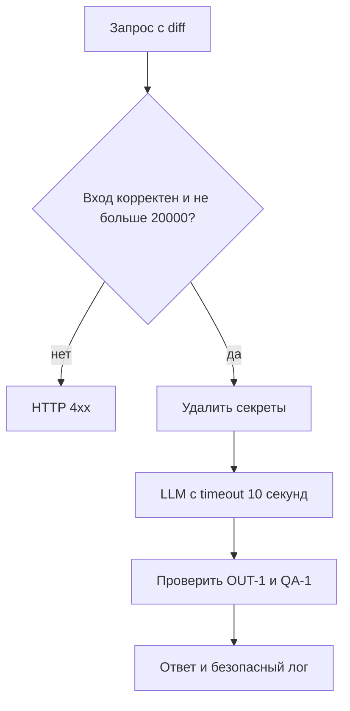

# Анализ процесса: AS IS и TO BE

## AS IS

1. Клиент отправляет JSON с `diff`.
2. API обращается к `payload["diff"]` без схемы и лимита.
3. Сервис вставляет сырой diff в prompt.
4. Внешний LLM вызывается без заданного timeout.
5. Клиент получает произвольный `comment`; доказательность результата не проверяется.

Точки потери контроля: вход, секреты, длительность вызова и структура ответа.

## TO BE

## Разница

| Что меняется | AS IS | TO BE | Как проверим |
|---|---|---|---|
| Вход | Любой `dict` | Схема и лимит 20 000 | 422/413 на ошибочный вход |
| Безопасность | Сырой diff | Секреты заменены на `[REDACTED]` | Fake LLM не получает token |
| Надёжность | Неограниченный вызов | Timeout 10 секунд | Fake LLM с задержкой |
| Результат | `comment` | `summary`, `risks`, `checks` | Schema test, `risks <= 3` |
| Логи | Неизвестно | Только ID, время, статус | Capture logs |

## Как использовали AI

- Для чего: преобразовать правила кейса в наблюдаемый процесс TO BE.
- Тип промпта: R.C.T.F. и ReAct.
- Строка в [`prompts.md`](prompts.md): `P1-03`.
- Проверка человеком: каждый переход связан с `SEC-1`, `API-1`, `REL-1`, `OUT-1` или `OBS-1`.
