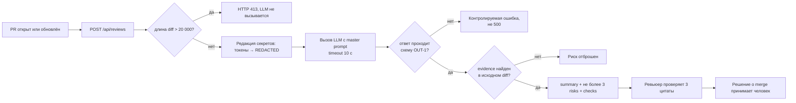

# Анализ процесса: AS IS и TO BE

## AS IS

Событие: автор открыл или обновил pull request. Участники: автор PR и ревьюер, автоматики нет.

Ревьюер открывает дифф и читает его целиком. Соответствие правилам репозитория `SEC-1`…`OBS-1` из [`CASE.md`](CASE.md) он держит в голове и сверяет по памяти: отдельного чеклиста в процессе нет, проверка не отделена от чтения кода. Дальше он пишет комментарии и принимает решение.

Ручные операции: полное прочтение диффа, сверка с правилами репозитория, формулировка каждого замечания.

Задержка: время ревью растёт линейно с размером диффа, потому что сокращать нечего: правило может быть нарушено в любой строке.

Точки потери информации две.

1. Правила зафиксированы письменно, а применяются по памяти. Чем менее заметно нарушение глазами, тем вероятнее пропуск. В [`TRAINING_PR.diff`](TRAINING_PR.diff) нарушение `SEC-1` умещается в одну строку `prompt = f"Review this pull request and find problems:\n{diff}"` и внешне выглядит обычной f-строкой.
2. Нарушения вида «кода нет», то есть `API-1` и `REL-1`, не видны при чтении вообще: пропущенную проверку длины и отсутствующий таймаут надо специально искать.

Попытка закрыть это свободным запросом к LLM процесс не улучшает. В запуске `P1-01` модель без контекста выдала 7 замечаний: ни одного с номером строки или цитатой, 5 из 7 не опираются ни на одно правило репозитория, `SEC-1` пропущен полностью. Ревьюеру всё равно приходится перечитывать дифф, чтобы отделить доказанное от выдуманного, — то есть шаг добавился, а работа не убавилась.

## TO BE

Один процесс: получить по диффу разбор, каждое утверждение в котором проверяется одним обращением к исходнику.

Границы вмешательства AI на схеме видны буквально: модель занимает один блок посередине, вход в неё урезан двумя фильтрами, выход прикрыт двумя проверками, а решение остаётся в правом крайнем узле у человека. Это `SCOPE-1`, положенный на процесс.

Нотация flowchart выбрана потому, что процесс линейный с тремя точками ветвления; BPMN здесь дал бы дорожки и события без нового смысла.

## Разница

| Что меняется | AS IS | TO BE | Как проверим изменение |
|---|---|---|---|
| Объём чтения | ревьюер читает дифф целиком | ревьюер проверяет не более трёх цитат, дифф читает выборочно | метрика «доля рисков с evidence» в [`problem.md`](problem.md): 0 из 7 в `P1-01` → 100% элементов `risks` |
| Сверка с правилами | по памяти, полнота не гарантирована | правила в Context Pack, каждый риск несёт ID нарушенного | метрика «покрытие правил»: 0 из 5 явно в `P1-01` → не менее 3 из 5 при лимите `OUT-1` |
| Нарушения «кода нет» | практически не находятся | `API-1` и `REL-1` в пакете, привязка к строке, где кода не хватает | `P1-02` привязал `REL-1` к `app/review_service.py:15` |
| Форма результата | свободная проза | JSON фиксированной структуры, отклонения режет валидатор | метрика соответствия `OUT-1`: 0 из 1 в `P1-01` → 100%; решение в [`adr.md`](adr.md) |
| Утечка содержимого диффа | дифф уходит во внешний LLM как есть | редакция секретов до формирования промпта | unit-проверка `SEC-1` в [`tests_unit.md`](tests_unit.md) |

Что **не** меняется: решение о merge, объём ответственности ревьюера за это решение и необходимость смотреть в дифф. Меняется только то, сколько диффа надо прочитать, чтобы решение принять.

## Как использовали AI

- Для чего: сравнение `P1-01` и `P1-02` показало, какие шаги процесса сейчас держатся только на внимании ревьюера; из этого собраны AS IS и TO BE.
- Тип промпта: zero-shot (`P1-01`) и master prompt (`P1-02`).
- Строка в [`prompts.md`](prompts.md): `P1-01`, `P1-02`.
- Что проверили и исправили сами: каждый узел TO BE привязан к правилу из `CASE.md`; узлов «на всякий случай» не добавляли. Из схемы убрали аутентификацию и rate limiting: они всплыли в `P1-01`, но в правилах репозитория их нет, и в `problem.md` они уже отнесены к тому, что не входит в задачу.
