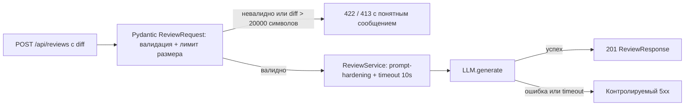

# Анализ процесса: AS IS и TO BE

## AS IS

Клиент (разработчик или CI) отправляет `POST /api/reviews` с телом `{"diff": string}`. Обработчик в `app/api.py` читает `payload["diff"]` напрямую, без валидации, и вызывает `review_service.review(diff)`. `ReviewService` подставляет diff в текстовый prompt и синхронно вызывает `llm.generate` без timeout и без обработки исключений. Ответ — `{"comment": answer}` без объявленной схемы и без явного статус-кода.

Задержка и потеря информации происходят на двух шагах: если поле `diff` отсутствует — необработанный `KeyError` превращается в голый `500` без объяснения причины; если LLM-вызов падает или зависает — исключение или задержка тоже долетает до клиента как непрозрачный `500`. Ручных операций в процессе нет, но нет и точки, где решение принимает человек — сервис либо отвечает, либо падает.

## TO BE

## Разница

| Что меняется | AS IS | TO BE | Как проверим изменение |
|---|---|---|---|
| Валидация входа | `payload: dict`, отсутствие `diff` → необработанный `KeyError` → 500 | `Pydantic ReviewRequest`, отсутствие `diff` → 422 | integration-тест: `POST` без поля `diff` ожидает 422 |
| Лимит размера | Нет ограничения | `diff` длиннее 20 000 символов → 413 (`API-1`) | integration-тест с `diff` в 20 001 символ |
| Обработка ошибок LLM | Необработанное исключение → голый 500 | `try/except` + timeout 10с (`REL-1`) → контролируемый 5xx | unit-тест с моком, который бросает исключение или зависает |
| Схема и статус ответа | `dict[str, str]` без контракта, статус по умолчанию 200 | `response_model=ReviewResponse`, `status_code=201` | контракт-тест по OpenAPI-схеме |

## Как использовали AI

- Для чего: сравнить текущий (AS IS) и целевой (TO BE) поток обработки запроса, чтобы явно увидеть, где именно теряется информация об ошибке.
- Тип промпта: master prompt (см. [`prompts.md`](prompts.md)) — тот же Context Pack, что и для P1-02, применён к построению процесса, а не только к списку рисков.
- Строка в [`prompts.md`](prompts.md): P1-02.
- Что проверили и исправили сами: сопоставили каждый шаг AS IS с конкретной строкой `app/api.py`/`app/review_service.py` из diff; убедились, что TO BE закрывает все три подтверждённых риска из P1-02, а не только один.
