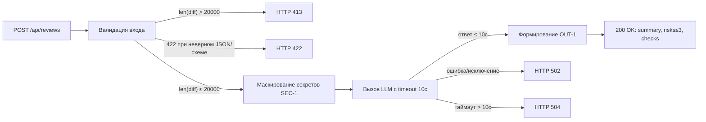

# Анализ процесса: AS IS и TO BE

## AS IS

Сценарий сейчас по TRAINING_PR.diff:

- Триггер: POST на `/api/reviews` с произвольным `payload: dict`.
- Вход: нет Pydantic-схемы; берётся `payload["diff"]`. При отсутствии ключа — `KeyError` → 500.
- Проверки: отсутствуют SEC-1 (маскирование секретов), API-1 (порог 20000 символов), REL-1 (таймаут 10с).
- Вызов LLM: промпт содержит сырой diff; возможна утечка секретов и длинные ответы; отсутствие таймаута приводит к зависаниям.
- Ответ: `{"comment": ...}` вместо структуры OUT-1 (`summary`, `risks`, `checks`).
- Логи: нет явного соблюдения OBS-1 (должны логироваться только `request_id`, длительность и статус; содержимое diff и ответ не логируются).

## TO BE

Один небольшой процесс: безопасная обработка diff с контролем размера, маскированием секретов и предсказуемым ответом.

## Разница

| Что меняется | AS IS | TO BE | Как проверим изменение |
|---|---|---|---|
| Валидация входа | dict и `payload["diff"]` → 500 при отсутствии | Pydantic-схема → 422 при неверном входе | Интеграционный тест: POST без `diff` → 422 |
| Ограничение размера | Нет 20000-лимита | 413 при `len(diff) > 20000` | Интеграционный тест: сгенерировать 20001 символ → 413 |
| SEC-1 маскирование | Дифф сырой уходит в LLM | Маскирование токенов/паролей/PEM → `[REDACTED]` | Юнит: подмена LLM и проверка промпта содержит `[REDACTED]` |
| REL-1 таймаут | Нет таймаута → подвисания | Таймаут 10с и контролируемые ответы 502/504 | Интеграция: мок LLM с задержкой >10с → 504; исключение → 502 |
| Формат ответа | `{"comment": ...}` | JSON по OUT-1: summary, risks≤3, checks | E2E: валидный дифф → 200 и валидный OUT-1 |
| Логирование | Не определено | OBS-1: только request_id, duration, status | Code review + unit на формат записи логов |

## Как использовали AI

- Для чего: описать целевой процесс TO BE, зафиксировать различия и проверяемость изменений.
- Тип промпта: Master Prompt v2
- Строка в [`prompts.md`](prompts.md): P1-04
- Что проверили и исправили сами: проверили синтаксис Mermaid и кавычки у стрелок с условиями; убедились, что таблица «Разница» сохранена без изменений структуры.
