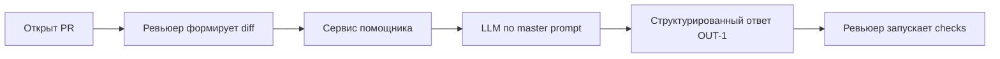

# Анализ процесса: AS IS и TO BE

## AS IS

Разработчик создаёт PR. Ревьюер просматривает diff вручную, пишет комментарии в свободной форме. Нет единого шаблона, часто отсутствуют ссылки на конкретные строки и воспроизводимые проверки. Задержка: поиски базовых проблем занимают 10–15 минут и зависят от опыта.

## TO BE

Добавляем помощника: ревьюер отправляет diff в сервис. Сервис готовит промпт для LLM по правилам Context Pack и возвращает структурированный результат: summary, ≤3 risks с file:line и evidence, список checks. Ревьюер подтверждает/отклоняет риски и запускает проверки. Результат становится воспроизводимым.

## Разница

| Что меняется | AS IS | TO BE | Как проверим изменение |
|---|---|---|---|
| Формат замечаний | Свободный текст | Структура OUT‑1 | Наличие полей и ≤3 рисков |
| Доказательность | Часто без ссылок | file:line + evidence | Ручная выборка 10 ответов |
| Время первичного ревью | 10–15 мин | ≤5 мин | Засечь время на 5 PR |

## Как использовали AI

- Для чего:
- Тип промпта: master prompt для описания TO BE
- Строка в [`prompts.md`](prompts.md): Master Prompt v1
- Что проверили и исправили сами: выровняли нотацию с CASE.md; ограничили объём рисков и добавили evidence как обязательный атрибут.
