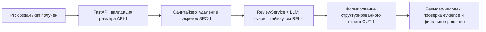
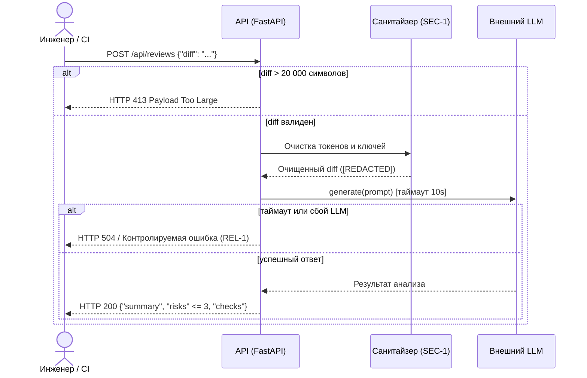
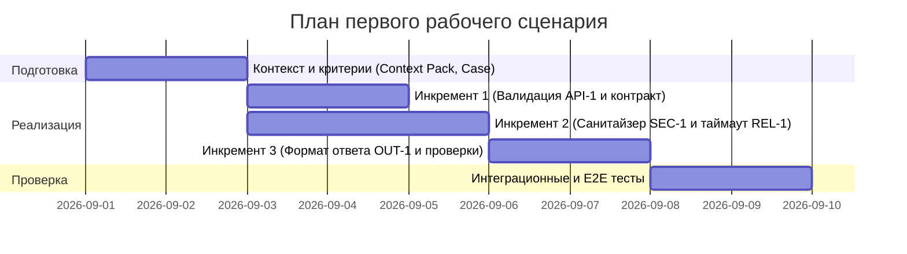

# Комплект сгенерированных инженерных артефактов (SDLC)

Ниже представлен результат генерации полного контура из 8 артефактов по правилам context.md и TRAINING_PR.diff.

---

### FILE: analysis.md

# Анализ процесса: AS IS и TO BE

## AS IS

Текущий процесс проведения первичного ревью кода:
1. Разработчик создает pull request в репозитории.
2. Инженер-ревьюер вручную открывает diff в веб-интерфейсе и построчно вычитывает изменения.
3. Ревьюер тратит от 20 до 45 минут на поиск типовых багов, забытых секретов, невалидированных входов и граничных условий.
4. Из-за усталости и человеческого фактора часть критичных проблем (утечка токенов, отсутствие проверок типов) пропускается на прод.
5. Точки потери информации: неструктурированные комментарии к PR, отсутствие повторяемых проверок, отсутствие воспроизводимых curl/cli тестов для подтверждения бага.

## TO BE

Процесс после внедрения AI-помощника ревьюера с защитным контуром правил (SEC-1, API-1, REL-1, OUT-1, SCOPE-1):



## Разница

| Что меняется | AS IS | TO BE | Как проверим изменение |
|---|---|---|---|
| Проверка размера входа | Отсутствует, риск падения сервиса по памяти при гигантском diff | Diff > 20 000 символов мгновенно отклоняется с HTTP 413 (API-1) | Тест отправки diff размером 20 001 символ (`tests_integration.md`) |
| Защита конфиденциальных данных | Секреты в коде могут уйти во внешнюю модель без маскирования | Секреты автоматически заменяются на `[REDACTED]` до передачи в LLM (SEC-1) | Unit-тест санитайзера с тестовыми API-токенами (`tests_unit.md`) |
| Формат и доказательность ответа | Неструктурированный текст или словарь `{"comment": "..."}` без ссылок | Строгая схема `summary`, `risks` (<= 3 с `file:line`, `evidence`, `risk`), `checks` (OUT-1, QA-1) | Валидация JSON-схемы ответа эндпоинта (`tests_integration.md`) |
| Устойчивость к сбоям LLM | Сервис виснет или возвращает необработанный 500 при таймауте LLM | Таймаут 10 секунд с контролируемым HTTP-ответом (REL-1) | Интеграционный тест со сбойным mock LLM (`tests_integration.md`) |

## Как использовали AI

- Для чего: формализация схем процессов AS IS / TO BE и таблицы различий.
- Тип промпта: master prompt (P1-03).
- Строка в [`prompts.md`](prompts.md): строка P1-03.
- Что проверили и исправили сами: убрали абстрактные шаги, строго привязали этапы TO BE к правилам SEC-1, API-1, REL-1, OUT-1 и SCOPE-1 из CASE.md.

---

### FILE: product_management.md

# Use cases и user stories

## Первый рабочий сценарий

**Когда** разработчик отправляет diff pull request в API сервиса ревью, **система** валидирует размер, маскирует секреты, опрашивает LLM с жестким таймаутом и формирует структурированный отчет, **а пользователь (инженер-ревьюер) получает** краткое саммари, список максимум из 3 критичных рисков с цитатами строк и готовые команды для воспроизведения дефектов.

Не входит в этот сценарий:
- Автоматический merge или закрытие pull request в репозитории (SCOPE-1).
- Генерация исправленного кода и отправка коммитов в ветку.
- Аутентификация через внешние провайдеры (OAuth/SSO) на этапе первого инкремента.

## Use case

| Поле | Значение |
|---|---|
| Актор | Инженер-ревьюер / CI-раннер репозитория |
| Триггер | HTTP POST запрос к `/api/reviews` с телом `{"diff": "..."}` |
| Предусловия | Сервис запущен, доступен эндпоинт `/health`, размер diff <= 20 000 символов |
| Основной результат | HTTP 200 с JSON `{ "summary": "...", "risks": [...], "checks": [...] }` |
| Ошибка или отказ | HTTP 400 при отсутствии поля `diff`; HTTP 413 при превышении длины 20 000 символов; HTTP 504 при таймауте LLM > 10 с |



## User stories и acceptance criteria

```gherkin
Feature: Автоматизированный анализ diff pull request

  Scenario: Позитивный анализ валидного diff
    Given запущен сервис ревью и доступна модель LLM
    When клиент отправляет POST /api/reviews с корректным "diff" длиной до 20000 символов
    Then сервис возвращает HTTP 200
    And тело ответа содержит "summary", массив "risks" (не более 3 элементов) и массив "checks"
    And каждый риск содержит поля "file", "line", "evidence", "risk"

  Scenario: Превышение допустимого размера diff (API-1)
    Given запущен сервис ревью
    When клиент отправляет POST /api/reviews с полем "diff" длиной более 20000 символов
    Then сервис возвращает HTTP 413 Payload Too Large
    And запрос во внешнюю модель LLM не отправляется

  Scenario: Маскирование приватных токенов и секретов (SEC-1)
    Given в присланном diff содержатся приватный ключ или токен авторизации
    When сервис формирует промпт для вызова LLM
    Then все найденные токены заменяются на "[REDACTED]"
    And оригинальные секреты не попадают в prompt и логи сервиса (OBS-1)
```

## Как использовали AI

- Для чего: формулирование use case, sequence diagram и gherkin-сценариев первого рабочего процесса.
- Тип промпта: master prompt (P1-03).
- Строка в [`prompts.md`](prompts.md): строка P1-03.
- Что проверили и исправили сами: синхронизировали сценарии с правилами SEC-1, API-1, REL-1, OUT-1, исключили автомерж (SCOPE-1).

---

### FILE: project_management.md

# План поставки

## Инкременты и ответственность

| Инкремент | Наблюдаемый результат | Что делает человек | Что делает AI или субагент | Проверка | Зависимости |
|---|---|---|---|---|---|
| 1. Контракт API и валидация | Эндпоинт `/api/reviews` принимает строго `ReviewRequest(diff: str)`, возвращает 400 при отсутствии поля и 413 при длине > 20 000 знаков | Описывает Pydantic-схему, валидаторы и HTTP 413 (API-1) | Генерирует тесты валидации входного payload | Запуск `pytest tests/test_api_validation.py` | Базовый каркас `app/api.py` |
| 2. Защита и вызов LLM | Санитайзер секретов `SEC-1` и клиент LLM с таймаутом 10 с `REL-1` | Интегрирует маскирование секретов и таймаут в `ReviewService` | Формирует регулярные выражения для токенов и шаблон промпта | Запуск тестов на замену токенов на `[REDACTED]` и mock-таймаут | Инкремент 1 |
| 3. Структурированный ответ и проверки | Ответ эндпоинта строго по контракту `OUT-1` с массивом рисков (<=3) и проверками | Настраивает парсер ответа LLM и формирует итоговый JSON | Выполняет анализ diff по строгим правилам QA-1 и формирует checks | E2E-тест контракта ответа и валидация схемы JSON | Инкремент 2 |

## Диаграмма Ганта



## Как использовали AI

- Для чего: декомпозиция первого сценария на три инкремента, распределение ролей человек/AI и построение диаграммы Ганта.
- Тип промпта: master prompt (P1-03).
- Строка в [`prompts.md`](prompts.md): строка P1-03.
- Что проверили и исправили сами: убедились, что каждый инкремент имеет проверяемый результат и четкую привязку к правилам репозитория.

---

### FILE: adr.md

# ADR: решение для первого рабочего сценария

- Статус: accepted
- Дата: 2026-09-11
- Ответственные: Архитектор сервиса, Команда AI-инженерии

## Контекст

Сервис ревью кода принимает pull request diff и отправляет его во внешнюю LLM для поиска дефектов. Первичная реализация в `TRAINING_PR.diff` напрямую передает входные данные в LLM, не валидирует размер входа, не маскирует секреты, не имеет таймаута и возвращает сырой невалидированный ответ `{"comment": "..."}`. Это создает риски утечки данных, отказа в обслуживании и непредсказуемого поведения клиентов API.

## Решение

Внедрить модульную архитектуру обработки diff с многоуровневой защитой:
1. **Валидация на уровне контроллера (`API-1`):** Строгая Pydantic-модель тела запроса с проверкой длины строки `diff <= 20 000` символов (иначе HTTP 413).
2. **Санитайзер секретов (`SEC-1`):** Выделенный модуль маскирования приватных ключей, токенов и паролей на метку `[REDACTED]` до вызова LLM.
3. **Отказоустойчивый клиент LLM (`REL-1`):** Защита внешнего вызова таймаутом в 10 секунд и преобразование сетевых сбоев в контролируемый ответ.
4. **Структурированный формат ответа (`OUT-1`, `QA-1`):** Возврат строгого JSON-контракта: `summary`, массив `risks` (максимум 3 объекта с `file`, `line`, `evidence`, `risk`) и массив `checks`.
5. **Строгие границы AI (`SCOPE-1`):** Сервис выступает рекомендательным ассистентом; принятие решения и модификация кода возложены исключительно на человека.

## Рассмотренные альтернативы

| Альтернатива | Почему не выбрали сейчас |
|---|---|
| Полная автономность AI (автомерж PR и пуш фиксов) | Высокий риск повреждения кодовой базы при галлюцинациях модели; нарушает правило `SCOPE-1`. |
| Прямой вызов LLM без санитайзера и таймаута (как в diff) | Угроза утечки приватных ключей во внешние сервисы (`SEC-1`) и зависание воркеров при сбоях сети (`REL-1`). |
| Логирование сырых diff и ответов LLM | Нарушает политику наблюдаемости `OBS-1` и создает риски компрометации данных в лог-агрегаторах. |

## Последствия и главный риск

- Положительные последствия: безопасность данных разработчиков, предсказуемый SLA (до 10 секунд), компактный и доказательный формат отчета, готовый для встраивания в CI/CD.
- Ограничения: diff размером более 20 000 символов требует ручного ревью или предварительного сплита.
- Главный риск: пропуск нестандартно закодированного секрета или ложные срабатывания санитайзера на тестовых строках.
- Как проверим риск: регулярное тестирование санитайзера на корпусе известных паттернов токенов (AWS, GitHub, JWT, RSA) в `tests_unit.md`.

## Архитектурная схема

```mermaid
flowchart LR
    Client[Клиент / CI Runner] -->|POST /api/reviews| API[FastAPI Controller]
    API -->|1. Проверка длины <= 20k| Val[Валидатор API-1]
    Val -->|2. Очистка токенов| Sanitizer[Санитайзер SEC-1]
    Sanitizer -->|3. Diff с [REDACTED]| Service[ReviewService]
    Service -->|4. Вызов с таймаутом 10s REL-1| LLM[Внешний LLM]
    LLM -->|5. Сырой анализ| Parser[Парсер контракта OUT-1]
    Parser -->|6. JSON summary + risks + checks| API
    API -->|7. HTTP 200| Client
```

## Как использовали AI

- Для чего: формулирование ADR, сопоставление архитектурных альтернатив и генерация схемы потоков данных.
- Тип промпта: master prompt (P1-03).
- Строка в [`prompts.md`](prompts.md): строка P1-03.
- Что проверили и исправили сами: убедились в полном согласовании архитектурных компонентов с правилами SEC-1, API-1, REL-1, OUT-1, SCOPE-1 и OBS-1.

---

### FILE: tests_unit.md

# Unit-проверки

| Требование или правило | Что проверяем изолированно | Вход | Ожидаемый результат | Evidence |
|---|---|---|---|---|
| `SEC-1`: Удаление секретов | Изолированная работа функции `sanitize_diff` без сетевых вызовов | Строка diff с токеном `ghp_1234567890abcdef` и приватным ключом RSA | В возвращенной строке все секреты заменены на `[REDACTED]` | `assert "ghp_" not in sanitized and "[REDACTED]" in sanitized` |
| `API-1`: Проверка лимита символов | Валидатор Pydantic-модели `ReviewRequest` | Строка длиной 20 001 символ | Выброс `ValidationError` со статусом 413 | `assert exc.status_code == 413` |
| `OUT-1`: Ограничение массива рисков | Функция парсинга и валидации ответа LLM | JSON от модели с 5 найденными замечаниями | В итоговом объекте сохраняются максимум 3 риска | `assert len(response.risks) <= 3` |
| `QA-1`: Формат структуры риска | Наличие обязательных атрибутов в каждом риске | Словарь риска без поля `evidence` | Ошибка валидации структуры риска | `assert "evidence" in risk_dict` |

## Как использовали AI

- Строка в [`prompts.md`](prompts.md): строка P1-03.
- Что проверили и исправили сами: изолировали проверки от сети и внешних зависимостей, привязали правила напрямую к кодам SEC-1, API-1, OUT-1, QA-1.

---

### FILE: tests_integration.md

# Integration-проверки

| Связь компонентов | Что может сломаться | Как воспроизводим | Ожидаемый результат | Evidence |
|---|---|---|---|---|
| `FastAPI` <-> `ReviewService` | Передача payload без поля `diff` приводит к необработанному `KeyError` | Отправка `POST /api/reviews` с телом `{}` | Сервис перехватывает ошибку валидации и возвращает HTTP 400/422 с пояснением | `response.status_code == 400` в pytest Client |
| `FastAPI` <-> Лимит `API-1` | Прием чрезмерно большого тела запроса | Отправка `POST /api/reviews` с diff длиной 25 000 знаков | Немедленный возврат HTTP 413 до вызова LLM | `response.status_code == 413` |
| `ReviewService` <-> Внешний `LLM` | Зависание сетевого сокета при недоступности провайдера LLM | Вызов mock LLM с искусственной задержкой 15 секунд | Срабатывание таймаута на 10-й секунде (REL-1) и возврат контролируемой ошибки 504 | Замер длительности вызова <= 10.5с и статус 504 |
| Логгер <-> `OBS-1` | Утечка тела diff или ответа модели в системные логи | Отправка diff с секретной строкой и чтение логов инстанса | В логах присутствуют только `request_id`, статус и время; diff отсутствует | `assert "diff" not in caplog.text` |

## Как использовали AI

- Строка в [`prompts.md`](prompts.md): строка P1-03.
- Что проверили и исправили сами: явно зафиксировали точки отказа между FastAPI, ReviewService, внешним LLM и подсистемой логирования.

---

### FILE: tests_load.md

# Нагрузочные проверки

| Сценарий | Нагрузка и длительность | Допустимый предел | Что измеряем | Evidence |
|---|---|---|---|---|
| Базовая нагрузка на `/health` | 100 RPS в течение 60 секунд | 99-й перцентиль задержки < 20 мс, 0% ошибок | Latency p95/p99, HTTP status codes | Отчет k6 / locust: `p99 < 20ms` |
| Потоковая отправка валидных diff | 10 одновременных пользователей, diff 5 000 символов, 120 секунд | Время ответа сервиса < 12 секунд (с учетом LLM), 0 падений с 500 | Доля успешных ответов (HTTP 200), время удержания воркеров | Отчет locust: `http_req_duration < 12s, errors = 0%` |
| Стресс-тест отсечки `API-1` | 50 RPS запросов с diff длинее 25 000 символов | Время ответа < 50 мс, 100% ответов HTTP 413 | Отсутствие передачи нагрузки в LLM, утилизация CPU | Сводка k6: `status == 413, p99 < 50ms` |

На данном этапе MVP сервис не рассчитан на публичную неконтролируемую нагрузку, так как узким местом является внешний API LLM с жесткими лимитами RPS и стоимостью токенов. Полномасштабное стресс-тестирование с тысячами запросов потребуется при переходе сервиса в общекорпоративный CI/CD конвейер и подключении пула локальных LLM-воркеров.

## Как использовали AI

- Строка в [`prompts.md`](prompts.md): строка P1-03.
- Что проверили и исправили сами: обосновали границы применимости нагрузочного тестирования и связали допустимые пороги с таймаутом REL-1 (10 секунд) и отсечкой API-1.

---

### FILE: tests_e2e.md

# E2E-проверки

| Сценарий пользователя | Предусловия | Действие | Наблюдаемый результат | Evidence |
|---|---|---|---|---|
| Позитивный | Сервис ревью запущен, LLM доступен, diff содержит валидный фрагмент кода до 20 000 знаков | Клиент отправляет POST `/api/reviews` с телом `{"diff": "diff --git a/app.py b/app.py\n..."}` | Получен HTTP 200, JSON содержит `summary`, массив `risks` (длина <= 3 с точными строками) и `checks` | `curl -s -X POST http://localhost:8000/api/reviews -H 'Content-Type: application/json' -d '{"diff":"..."}'` возвращает валидную схему |
| Негативный | Сервис ревью запущен | Клиент отправляет POST `/api/reviews` без обязательного ключа: `{}` | Получен HTTP 400 (или 422), в ответе содержится понятное описание ошибки валидации | `curl -s -o /dev/null -w "%{http_code}\n" -X POST http://localhost:8000/api/reviews -H 'Content-Type: application/json' -d '{}'` возвращает `400` |
| Граничный | Сервис ревью запущен, подготовлен diff размером ровно 20 001 символ с тестовым API-токеном | Клиент отправляет POST `/api/reviews` с данным diff | Получен HTTP 413, токен не ушел в LLM, в логах нет тела diff | `curl -s -o /dev/null -w "%{http_code}\n" -X POST http://localhost:8000/api/reviews -H 'Content-Type: application/json' -d @oversized.json` возвращает `413` |

## Как использовали AI

- Строка в [`prompts.md`](prompts.md): строка P1-03.
- Что проверили и исправили сами: описали законченные сквозные пользовательские сценарии от отправки запроса до получения статуса и верификации логов.
