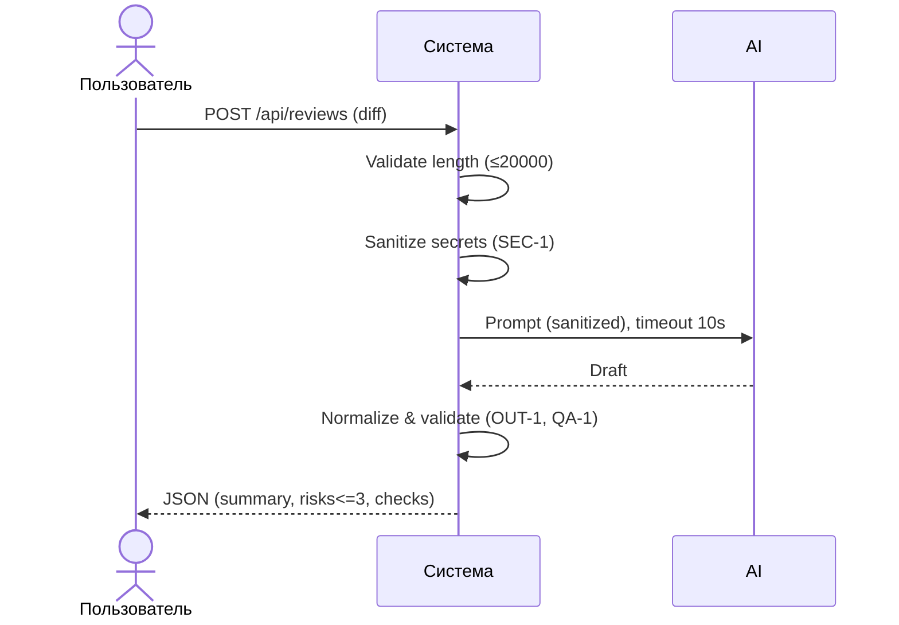

# Use cases и user stories

## Первый рабочий сценарий

**Когда** ревьюер или автор PR отправляет текстовый diff длиной не более 20 000 символов на POST /api/reviews, **система** валидирует длину, редактирует потенциальные секреты, вызывает внешний LLM с таймаутом 10 секунд, нормализует ответ по схеме и **пользователь получает** структурированный результат: summary (RU), до трёх risks с полями file/line/evidence/risk и список checks.

Не входит в этот сценарий:

- Интеграции с GitHub (approve/merge/комментарии), изменение кода в репозитории;
- Аутентификация/авторизация, биллинг;
- Сложные политики ретраев, очереди и SLA; локализация сверх описанного.

## Use case

| Поле               | Значение                                                                                                                                       |
| ------------------ | ---------------------------------------------------------------------------------------------------------------------------------------------- |
| Актор              | Ревьюер или автор PR                                                                                                                           |
| Триггер            | Отправка diff в /api/reviews                                                                                                                   |
| Предусловия        | Сервис доступен; длина diff ≤ 20000; корректная кодировка                                                                                      |
| Основной результат | HTTP 200; JSON: summary (RU), risks≤3 {file,line,evidence,risk}, checks[]                                                                      |
| Ошибка или отказ   | HTTP 413 для >20000; при таймауте LLM — HTTP 200 с контролируемым ответом (summary указывает на деградацию; risks=[], checks с ручными шагами) |



## User stories и acceptance criteria

```gherkin
Feature:

  Scenario: Позитивный — валидный diff
    Given сервис доступен и настроен
    And длина diff ≤ 20000 символов
    When пользователь отправляет diff на /api/reviews
    Then система возвращает 200
    And результат — валидный JSON по OUT-1 (summary RU, risks≤3 с file/line/evidence/risk, checks)

  Scenario: Негативный — большой diff
    Given сервис доступен
    And длина diff > 20000 символов
    When пользователь отправляет diff на /api/reviews
    Then система возвращает 413
    And запрос не уходит во внешний LLM

  Scenario: Граничный — таймаут LLM
    Given стаб LLM отвечает > 10 секунд
    When пользователь отправляет валидный diff
    Then система завершает вызов ≤ 10 секунд
    And возвращает 200 с контролируемым ответом: summary указывает на деградацию (RU), risks=[]
    And checks содержит воспроизводимые шаги ручной проверки и повторного запуска

  Scenario: Безопасность — редактирование секретов
    Given diff содержит токен/ключ/секрет
    When пользователь отправляет diff
    Then система не отправляет секреты во внешний LLM
    And в prompt используются маркеры [REDACTED]
    And логи содержат только request_id, duration, status и не содержат diff/LLM payload (OBS-1)
```

## Как использовали AI

- Для чего:
  - Сформулировать первый рабочий сценарий, use case и критерии приёмки из context.md/problem.md.
- Тип промпта:
  - Few shots.
- Строка в [`prompts.md`](prompts.md):
  - P1-06.
- Что проверили и исправили сами:
  - Поведение на границе 20000/20001, тексты критериев на русском.
