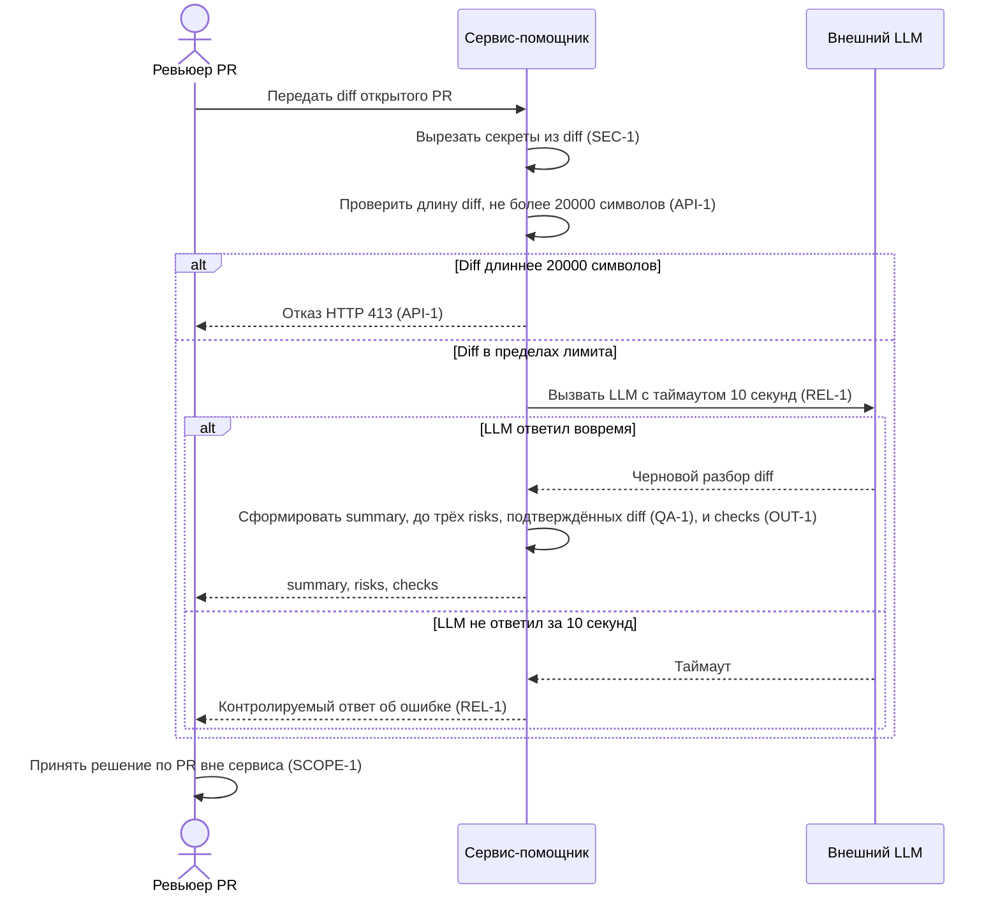

# Use cases и user stories

## Первый рабочий сценарий

**Когда** ревьюер запрашивает у сервиса разбор открытого PR (передаёт diff), **система** вырезает из diff секреты (SEC-1), проверяет его длину (API-1), вызывает внешний LLM с таймаутом 10 секунд (REL-1) и формирует структурированный ответ (OUT-1), **а пользователь получает** краткое summary изменения, не более трёх подтверждённых строкой diff рисков с файлом, строкой и доказательством (QA-1) и список проверок, которые стоит запустить перед решением по PR.

Не входит в этот сценарий:

- approve и merge PR — решение по PR всегда принимает человек, сервис его не выполняет (SCOPE-1);
- изменение кода в PR — сервис только советует, а не правит diff (SCOPE-1);
- обработка diff длиннее 20 000 символов — такой запрос отклоняется с HTTP 413 без вызова LLM (API-1);
- включение в ответ рисков, не подтверждённых конкретной строкой diff или правилом репозитория (QA-1).

## Use case

| Поле | Значение |
|---|---|
| Актор | Ревьюер PR |
| Триггер | Открытие PR в GitHub либо ручной запрос ревьюером разбора уже открытого PR |
| Предусловия | Diff PR не длиннее 20 000 символов (API-1); токены, пароли и приватные ключи вырезаны из diff перед отправкой во внешний LLM (SEC-1) |
| Основной результат | Ревьюер получает структурированный ответ по OUT-1: `summary`, до трёх `risks` (каждый с `file`, `line`, `evidence`, `risk`, подтверждённых по QA-1) и список `checks` |
| Ошибка или отказ | Diff длиннее 20 000 символов — сервис отклоняет запрос с HTTP 413, не вызывая LLM (API-1); внешний LLM не ответил за 10 секунд — сервис возвращает контролируемый ответ об ошибке вместо зависания (REL-1) |



## User stories и acceptance criteria

```gherkin
Feature: Разбор diff открытого PR AI-помощником ревьюера

  Scenario: Позитивный
    Given ревьюер открыл PR с diff длиной не более 20000 символов, из которого перед отправкой во внешний LLM вырезаны токены, пароли и приватные ключи (SEC-1)
    When ревьюер запрашивает у сервиса разбор этого PR
    Then сервис вызывает внешний LLM с таймаутом 10 секунд (REL-1) и возвращает ответ с summary, не более чем тремя risks, каждый из которых содержит file, line и evidence, подтверждающие риск строкой diff (QA-1, OUT-1), и список checks для запуска перед решением по PR

  Scenario: Негативный или граничный
    Given ревьюер открыл PR, diff которого длиннее 20000 символов
    When ревьюер запрашивает у сервиса разбор этого PR
    Then сервис отклоняет запрос с HTTP 413, не вызывая внешний LLM и не возвращая summary, risks или checks (API-1)
```

## Как использовали AI

- Для чего: черновик сценария, use case и gherkin-сценариев (позитивный и граничный) по правилам CASE.md.
- Тип промпта: master prompt (роль, входы, задача и артефакты, формат, границы, шаги, проверка перед выдачей заданы явно).
- Строка в [`prompts.md`](prompts.md): P1-03 (генерация артефактов master prompt'ом).
- Что проверили и исправили сами: сверили формулировки сценария и use case с CASE.md (SEC-1, API-1, REL-1, OUT-1, QA-1, SCOPE-1) и с ролями из context.md и problem.md на отсутствие противоречий; проверили, что диаграмма sequenceDiagram и gherkin синтаксически корректны; убедились, что «Не входит в этот сценарий» и негативный сценарий gherkin не противоречат друг другу и не добавляют правил сверх CASE.md; правила про snake_case и i18n не использовали.
