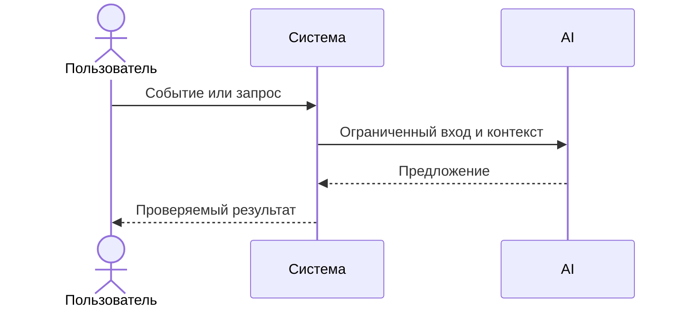

# Use cases и user stories

## Первый рабочий сценарий

Когда разработчик или CI отправляет валидный короткий diff (≤20000) в POST `/api/reviews`, система удаляет секреты, вызывает LLM с таймаутом 10 секунд и возвращает структурированный ответ OUT-1; пользователь получает краткий `summary`, до трёх подтверждённых `risks` и список `checks`.

Не входит в этот сценарий:

- approve/merge, изменение кода, действия в GitHub (SCOPE-1); логирование содержимого diff или ответа (OBS-1).

## Use case

| Поле | Значение |
|---|---|
| Актор | Разработчик или CI |
| Триггер | Вызов POST `/api/reviews` с `diff` |
| Предусловия | Diff ≤ 20000 символов; сервис доступен |
| Основной результат | HTTP 200 и JSON в формате OUT-1: `summary`, `risks` (≤3), `checks` |
| Ошибка или отказ | Если diff > 20000 → HTTP 413; при таймауте LLM → контролируемый структурированный ответ без 5xx |



## User stories и acceptance criteria

```gherkin
Feature: AI-reviewer возвращает структурированный ответ

  Scenario: Позитивный — валидный короткий diff
    Given сервис запущен и доступен
    And входной diff длиной менее 20000 символов
    When клиент отправляет POST /api/reviews с JSON {"diff": "+++ a.py\n..."}
    Then ответ имеет статус 200
    And тело содержит поля summary, risks, checks
    And в risks не более 3 элементов и каждый с полями file, line, evidence, risk

  Scenario: Негативный — слишком длинный diff
    Given сервис запущен и доступен
    And входной diff длиной более 20000 символов
    When клиент отправляет POST /api/reviews с этим diff
    Then ответ имеет статус 413
    And тело не содержит данных модели
```

## Как использовали AI

- Для чего: зафиксировать первый рабочий сценарий, use case и проверяемые критерии.
- Тип промпта: master prompt на основе контекста (P1-02).
- Строка в [`prompts.md`](prompts.md): P1-02; Master Prompt v1.
- Что проверили и исправили сами: сверили поля OUT-1 и правила API-1/REL-1 с TRAINING_PR.diff; убрали всё вне SCOPE-1.
