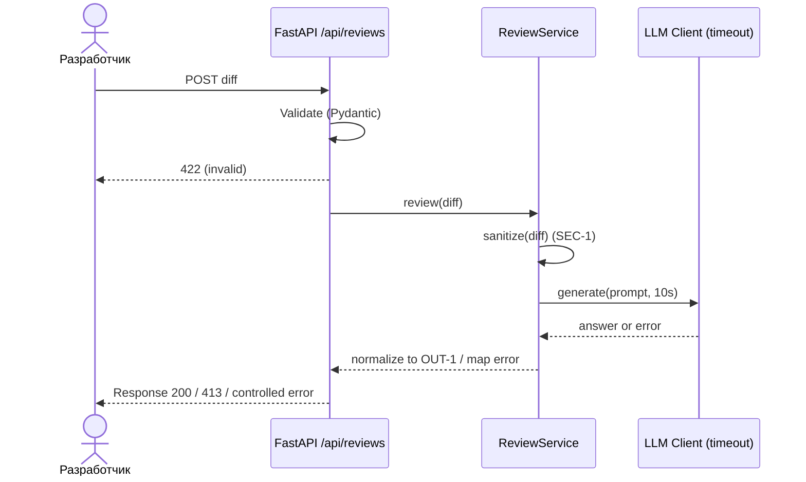

# Use cases и user stories

## Первый рабочий сценарий

Когда разработчик отправляет корректный `diff` на POST `/api/reviews`, система валидирует тело, санитизирует diff и возвращает краткое ревью: `summary`, до 3 рисков (с file:line и цитатами) и список проверок. Пользователь получает предсказуемый ответ или контролируемую ошибку.

Не входит в этот сценарий:

- Аутентификация/квоты, интеграция с SCM, хранение истории.

## Use case

| Поле | Значение |
|---|---|
| Актор | Разработчик/ревьюер |
| Триггер | Отправка diff на `/api/reviews` |
| Предусловия | Длина diff ≤ 20000; тело соответствует схеме |
| Основной результат | 200 OK и тело по OUT-1: `summary`, `risks` ≤ 3, `checks` |
| Ошибка или отказ | 422 при невалидном теле; 413 при длинном diff; контролируемая ошибка при таймауте LLM |



## User stories и acceptance criteria

```gherkin
Feature: Автоматическое ревью diff

  Scenario: Позитивный случай
    When я отправляю валидный diff на /api/reviews
    Then получаю 200 и JSON с полями summary, risks (<=3), checks

  Scenario: Невалидное тело запроса
    When я отправляю {} на /api/reviews
    Then получаю 422 с сообщением Pydantic-валидации

  Scenario: Слишком длинный diff
    When я отправляю diff длиной более 20000 символов
    Then получаю 413 Payload Too Large

  Scenario: Таймаут/ошибка LLM
    When LLM возвращает ошибку или не отвечает 10 секунд
    Then я получаю контролируемый ответ согласно REL-1
```

## Как использовали AI

- Для чего: Сформулировать use cases и user stories на базе правил CASE.md и контекста.
- Тип промпта: master prompt.
- Строка в [`prompts.md`](prompts.md): P1-02.
- Что проверили и исправили сами: Привязали критерии к OUT-1, SEC-1, API-1, REL-1.
