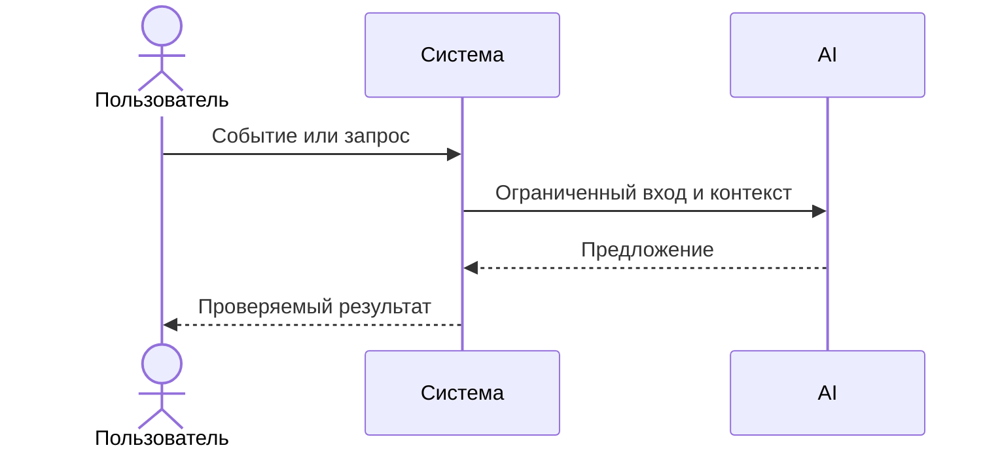

# Use cases и user stories

## Первый рабочий сценарий

**Когда** инженер отправляет валидный diff на POST `/api/reviews`, **система** валидирует вход, готовит безопасный prompt и вызывает LLM с таймаутом, **а пользователь получает** структурированный JSON (summary, ≤3 risks с evidence, checks).

Не входит в этот сценарий:

- Аутентификация/авторизация, rate limiting (зафиксировано как открытый вопрос).

## Use case

| Поле | Значение |
|---|---|
| Актор | Инженер/ревьюер |
| Триггер | Запрос POST `/api/reviews` с `{"diff": string}` |
| Предусловия | Доступен сервис; diff ≤20 000 символов; JSON валиден |
| Основной результат | Возвращён OUT‑1 JSON с summary, ≤3 risks и checks |
| Ошибка или отказ | 413 при слишком длинном diff; 4xx при невалидном JSON; контролируемая 5xx при ошибке LLM |



## User stories и acceptance criteria

```gherkin
Feature: Получение обзора диффа PR

  Scenario: Позитивный ответ
    Given сервис доступен
      And валидный JSON с ключом "diff" длиной ≤ 20_000 символов
    When пользователь вызывает POST /api/reviews
    Then ответ имеет статус 200
      And тело соответствует OUT-1: summary, risks<=3 (file, line, evidence, risk), checks

  Scenario: Негативный — отсутствует ключ diff
    Given сервис доступен
      And JSON без ключа "diff"
    When пользователь вызывает POST /api/reviews
    Then ответ имеет статус 422 или 400

  Scenario: Граничный — очень длинный diff
    Given сервис доступен
      And JSON с ключом "diff" длиной > 20_000 символов
    When пользователь вызывает POST /api/reviews
    Then ответ имеет статус 413
```

## Как использовали AI

- Для чего: описать сценарий использования и критерии приёмки на основе выявленных рисков.
- Тип промпта: master prompt для структуры; zero‑shot для первичных идей.
- Строка в [`prompts.md`](prompts.md): P1‑02.
- Что проверили и исправили сами: увязали сценарии с правилами OUT‑1, API‑1, REL‑1.
