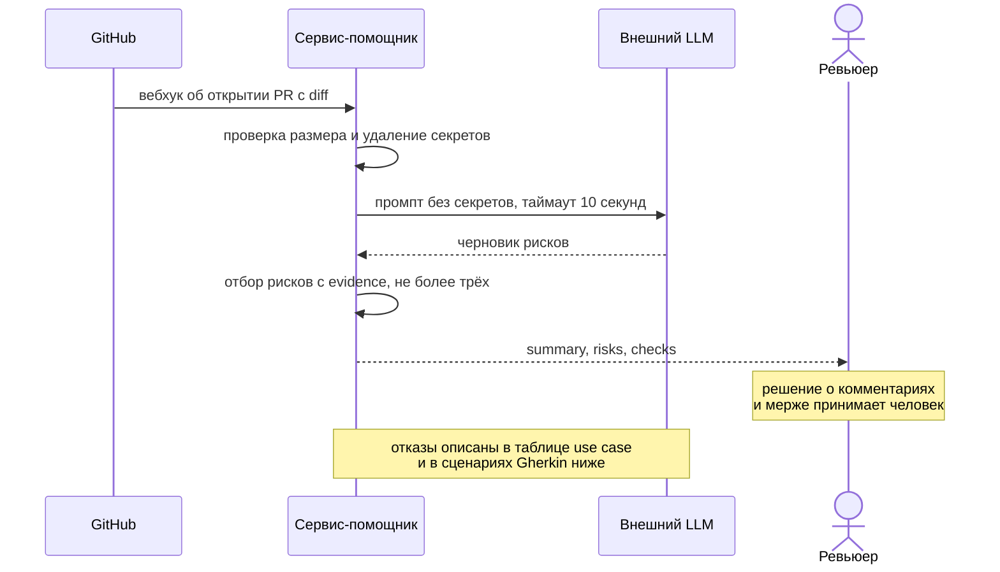

# Use cases и user stories

## Первый рабочий сценарий

**Когда** автор открывает пул-реквест, **система** по вебхуку от GitHub получает diff, вычищает из него секреты и готовит краткое описание изменения вместе с подтверждёнными рисками и списком проверок, **а пользователь получает** готовую точку входа в ревью вместо чистого diff к моменту, когда сядет за PR, и сам решает, что писать автору.

Не входит в этот сценарий:

- разбор нескольких пул-реквестов за один запрос и сравнение их между собой
- публикация комментариев в GitHub от имени помощника, а также approve и merge, это запрещено правилом `SCOPE-1`
- генерация исправленного кода или готового патча
- анализ файлов репозитория за пределами приложенного diff
- проверка стиля и форматирования, этим занимается линтер

## Use case

| Поле | Значение |
|---|---|
| Актор | Ревьюер backend-команды |
| Триггер | Автор открыл пул-реквест, GitHub отправил вебхук с diff |
| Предусловия | Вебхук на события открытия пул-реквеста настроен. Сервис-помощник запущен. Актуальные правила репозитория загружены в хранилище D1 |
| Основной результат | Ревьюер получает `summary`, не более трёх рисков с полями `file`, `line`, `evidence`, `risk` и список проверок. Решение о комментариях и мерже принимает сам ревьюер |
| Ошибка или отказ | diff длиннее 20000 символов отклоняется с HTTP 413 в ответ на вебхук и во внешний LLM не уходит, разбор для этого PR не появляется. Если ответ LLM не пришёл за 10 секунд, вместо разбора сохраняется контролируемая ошибка и ревьюер работает с diff вручную. Если ни один риск не подтверждён строкой diff или правилом, массив `risks` возвращается пустым и не добирается до трёх |



## User stories и acceptance criteria

- Как ревьюер, я хочу получать список подтверждённых рисков со ссылкой на файл и строку, чтобы не держать правила репозитория в памяти и не вычитывать весь diff вручную.
- Как ревьюер, я хочу видеть рядом с каждым риском способ его проверить, чтобы отличать требование репозитория от вкусовой правки при разговоре с автором.
- Как инженер по безопасности, я хочу быть уверенным, что содержимое diff не уходит во внешний сервис вместе с токенами и ключами, чтобы использование помощника не создавало нового канала утечки.

```gherkin
Feature: Подготовка ревью пул-реквеста помощником

  Scenario: Позитивный
    Given diff на 4000 символов, в котором есть нарушение правила SEC-1
    When GitHub отправляет вебхук об открытии этого пул-реквеста
    Then ответ содержит summary, массив risks и массив checks
    And в risks не более трёх элементов
    And каждый элемент risks содержит file, line, evidence и risk
    And хотя бы один риск ссылается на правило SEC-1

  Scenario: Негативный, diff превышает лимит
    Given diff на 25000 символов
    When GitHub отправляет вебхук об открытии этого пул-реквеста
    Then сервис отвечает HTTP 413
    And обращения к внешнему LLM не происходит

  Scenario: Негативный, внешний вызов не уложился в таймаут
    Given заглушка LLM, которая отвечает через 11 секунд
    When GitHub отправляет вебхук об открытии этого пул-реквеста
    Then ревьюер получает контролируемый ответ об ошибке, а не HTTP 500
    And в журнал записаны request_id, длительность и статус без содержимого diff

  Scenario: Граничный, ни один риск не подтверждён
    Given diff, в котором нет нарушений правил репозитория
    When GitHub отправляет вебхук об открытии этого пул-реквеста
    Then массив risks пуст
    And ответ не содержит рисков без evidence
```

## Как использовали AI

- Для чего: черновик use case, диаграммы взаимодействия и сценариев Gherkin
- Тип промпта: R.C.T.F.
- Строка в [`prompts.md`](prompts.md): `P1-05`
- Что проверили и исправили сами: забраковал первую версию диаграммы с вложенными ветвлениями как нечитаемую, отказы вынесены в таблицу use case и в сценарии. Выбрал вебхук от GitHub как триггер вместо ручного запроса ревьюера и потребовал согласовать это в диаграмме, use case и сценариях. Проверил рендер в VS Code
