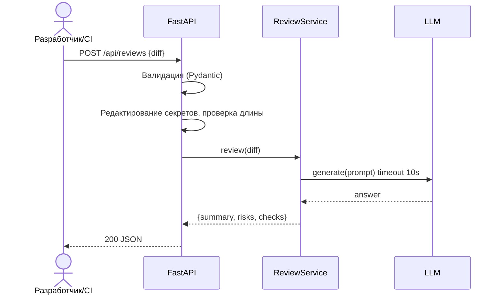

# Use cases и User Stories

## Первый рабочий сценарий

Когда разработчик или CI отправляет diff PR в POST `/api/reviews`, система валидирует вход, редактирует секреты, проверяет длину, формирует ограниченный промпт для LLM с таймаутом 10 секунд и возвращает структурированный ответ с `summary`, `risks` (до 3) и `checks` согласно CASE.md.

Не входит в этот сценарий:
- выбор конкретной LLM-модели и провайдера;
- автофиксы кода или действия в GitHub (SCOPE-1).

## Use cases

### UC-01: Ревью валидного diff
| Поле | Значение |
|---|---|
| Актор | Разработчик/CI |
| Предусловие | API доступно; провайдер LLM отвечает в пределах 10с |
| Основной сценарий | POST `/api/reviews` с телом `{ diff: string }` → валидация → редактирование секретов → проверка длины → LLM → маппинг OUT-1 |
| Альтернатива | Нет |
| Исключение | Нет |

### UC-02: Слишком длинный diff
| Поле | Значение |
|---|---|
| Актор | Разработчик/CI |
| Предусловие | API доступно |
| Основной сценарий | POST `/api/reviews` с `diff` > 20000 символов |
| Альтернатива | Пользователь сокращает diff или шлёт батчами |
| Исключение | — |

### UC-03: Таймаут LLM
| Поле | Значение |
|---|---|
| Актор | Разработчик/CI |
| Предусловие | Провайдер LLM зависает более 10с |
| Основной сценарий | POST `/api/reviews` с валидным diff → таймаут вызова LLM |
| Альтернатива | Повторить запрос позже |
| Исключение | Возврат контролируемого ответа вместо 5xx (REL-1) |



## User Stories и acceptance criteria

### US-01: Валидация входа
- Роль: как разработчик/CI
- Действие: хочу, чтобы тело запроса валидировалось по схеме `{ diff: string }`
- Ценность: чтобы не получать 500/KeyError и иметь предсказуемые ошибки
- Приоритет: Must Have
- Критерии приёмки:
  ```gherkin
  Scenario: 422 when diff is missing
    Given тело без поля "diff"
    When отправляем POST "/api/reviews"
    Then получаем 422 с описанием отсутствующего поля

  Scenario: 422 when diff has wrong type
    Given поле "diff" не является строкой
    When отправляем POST "/api/reviews"
    Then получаем 422

  Scenario: 200 on valid body
    Given тело содержит валидный "diff: string"
    When отправляем POST "/api/reviews"
    Then получаем 200 OK
  ```
- Метрика: Доля 422/500 < 1% (problem.md)

### US-02: Ограничение длины diff
- Роль: как владелец сервиса
- Действие: хочу отклонять слишком длинный diff
- Ценность: снизить нагрузку и стоимость, соблюсти API-1
- Приоритет: Must Have
- Критерии приёмки:
  ```gherkin
  Scenario: 413 when diff is too large
    Given длина поля "diff" равна 20001 символов
    When отправляем POST "/api/reviews"
    Then получаем 413 Payload Too Large

  Scenario: 200 when diff fits limit
    Given длина поля "diff" равна 1000 символов
    When отправляем POST "/api/reviews"
    Then получаем 200 OK
  ```
- Метрика: P95 ответа в пределах целевого значения (problem.md)

### US-03: Редактирование секретов
- Роль: как владелец безопасности
- Действие: хочу удалять секреты из diff перед отправкой в LLM
- Ценность: исключить утечки (SEC-1)
- Приоритет: Must Have
- Критерии приёмки:
  ```gherkin
  Scenario: Secrets are redacted
    Given diff содержит видимый "token=abc123"
    When выполняется препроцессинг перед отправкой в LLM
    Then в итоговом промпте вместо "token=" присутствует "[REDACTED]="

  Scenario: Non-secret text remains intact
    Given diff содержит обычный текст без секретов
    When выполняется препроцессинг
    Then промпт остаётся неизменённым
  ```
- Метрика: 0 инцидентов утечки (problem.md; CASE.md SEC-1)

### US-04: Таймаут и фолбэк LLM
- Роль: как пользователь API
- Действие: хочу предсказуемый ответ при таймауте LLM
- Ценность: отказоустойчивость и стабильность интеграций (REL-1)
- Приоритет: Should Have
- Критерии приёмки:
  ```gherkin
  Scenario: Controlled response on LLM timeout
    Given провайдер LLM не отвечает в течение 10 секунд
    When выполняется запрос POST "/api/reviews" с валидным diff
    Then сервис возвращает контролируемый ответ без 5xx

  Scenario: Normal response when LLM is timely
    Given провайдер LLM отвечает быстрее 10 секунд
    When выполняется запрос POST "/api/reviews" с валидным diff
    Then получаем 200 и структурированный JSON по OUT-1
  ```
- Метрика: Доля 5xx из‑за LLM близка к 0

### US-05: Структурированный ответ
- Роль: как интегратор CI
- Действие: хочу стабильный JSON `{ summary, risks[], checks[] }`
- Ценность: легко парсить и отображать
- Приоритет: Must Have
- Критерии приёмки:
  ```gherkin
  Scenario: OUT-1 contract is returned
    Given валидный diff
    When выполняется запрос POST "/api/reviews"
    Then ответ содержит поля "summary", "risks" и "checks" согласно OUT-1

  Scenario: Empty risks list is allowed
    Given валидный diff, по которому не выявлены риски
    When выполняется запрос POST "/api/reviews"
    Then поле "risks" содержит пустой массив
  ```
- Метрика: успешный парсинг в 100% позитивных кейсов

## Матрица соответствия story ↔ метрики

| Story | Метрика из problem.md |
|---|---|
| US-01 | Доля 422/500 < 1% |
| US-02 | P95 времени ответа в целевом пределе |
| US-03 | 0 инцидентов утечки |
| US-04 | Доля 5xx из‑за LLM близка к 0 |
| US-05 | Успешный парсинг ответа в 100% позитивных кейсов |

## Как использовали AI

- Запрос: practices/practice_01/prompts/product_plan.md
- Тип промпта: master (Role + Context Pack)
- Ссылка: prompts.md#master-2
- Проверка: связали stories с метриками из problem.md и правилами из CASE.md.
