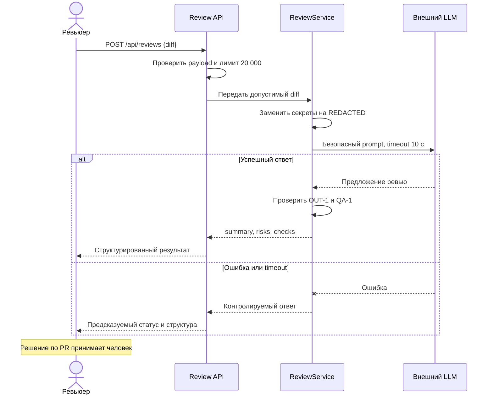

# Use cases и user stories

## Первый рабочий сценарий

**Когда** ревьюер отправляет допустимый diff на ревью, **система** проверяет размер, удаляет секреты, запрашивает внешний LLM с таймаутом и валидирует результат, **а пользователь получает** краткое описание, не более трёх доказанных рисков и список воспроизводимых проверок.

Не входит в этот сценарий:

- автоматические approve, merge или изменение кода;
- аутентификация и rate limiting, требования к которым не заданы;
- анализ diff длиннее 20 000 символов;
- гарантированное исправление всех проблем PR без проверки человеком.

## Use case

| Поле | Значение |
|---|---|
| Актор | Ревьюер или разработчик PR |
| Триггер | Отправка JSON с полем `diff` в `POST /api/reviews` |
| Предусловия | Поле `diff` имеет строковый тип и длину не более 20 000 символов; внешний LLM настроен |
| Основной результат | Ответ OUT-1: `summary`, `risks` (0–3 элемента с `file`, `line`, `evidence`, `risk`) и `checks` |
| Ошибка или отказ | Невалидный payload — контролируемая ошибка валидации; diff >20 000 — HTTP 413; ошибка/таймаут LLM — контролируемый ответ без утечки содержимого |



## User stories и acceptance criteria

```gherkin
Feature: Безопасное получение рекомендаций по ревью PR

  Scenario: Ревью допустимого diff
    Given diff длиной не более 20000 символов с тестовым токеном
    And внешний LLM отвечает корректным результатом
    When ревьюер отправляет POST /api/reviews
    Then в prompt для LLM токен заменён на "[REDACTED]"
    And ответ содержит summary, checks и не более 3 risks
    And каждый risk содержит file, line, evidence и risk
    And сервис не выполняет approve, merge или изменение кода

  Scenario: Diff превышает допустимый размер
    Given diff длиной 20001 символ
    When ревьюер отправляет POST /api/reviews
    Then сервис возвращает HTTP 413
    And внешний LLM не вызывается

  Scenario: Внешний LLM не отвечает вовремя
    Given допустимый diff
    And внешний LLM не отвечает в течение 10 секунд
    When ревьюер отправляет POST /api/reviews
    Then сервис завершает вызов по timeout
    And возвращает контролируемый ответ
    And в логах нет diff и ответа модели
```

## Как использовали AI

- Для чего: сформулировать один рабочий use case, пользовательские сценарии и проверяемые acceptance criteria.
- Тип промпта: use case + user story / Gherkin.
- Строка в [`prompts.md`](prompts.md): P1-06.
- Что проверили и исправили сами: сверили критерии с SEC-1, API-1, REL-1, OUT-1, SCOPE-1, QA-1 и OBS-1; исключили функции, которых нет в Context Pack.
